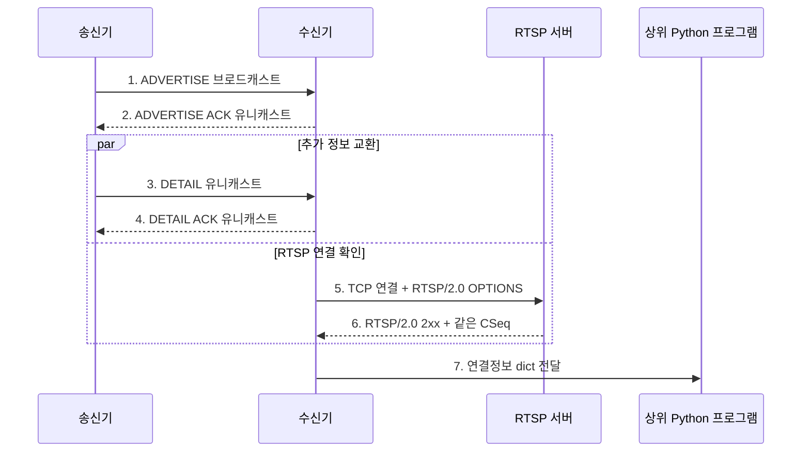

# 처음 배우는 RTSP Bootstrap

이 문서는 RTSP와 이 프로젝트를 처음 접하는 학부생을 위한 입문서다. IP 계층, UDP, TCP의 기본 개념은 알고 있다고 가정한다. 문서를 끝까지 읽으면 다음 질문에 답할 수 있어야 한다.

- RTSP는 영상 데이터 자체를 보내는 프로토콜인가?
- RTSP URI를 알기 전에 장비를 어떻게 찾는가?
- 왜 최초 메시지만 브로드캐스트이고 이후에는 유니캐스트인가?
- `ADVERTISE`, `DETAIL`, `ACK`는 각각 무엇을 뜻하는가?
- 이 모듈은 언제 장비 발견을 “성공”으로 상위 프로그램에 알리는가?
- CLI와 Python 코드로 송신기와 수신기를 어떻게 실행하는가?

## 1. 먼저 알아둘 핵심 세 문장

1. **RTSP는 원격 미디어 세션을 제어하는 애플리케이션 계층 프로토콜이다.**
2. **이 모듈은 RTSP 주소를 모르는 수신자에게 그 주소를 알려주는 발견용 프로토콜이다.**
3. **이 모듈의 ACK는 정보 수신 확인일 뿐, 영상 재생 성공 확인이 아니다.**

이 세 문장을 구분하면 프로젝트의 대부분을 이해한 것이다.

## 2. RTSP란 무엇인가?

RTSP는 Real Time Streaming Protocol의 약자다. 이름 때문에 영상 바이트를 직접 운반하는 프로토콜로 오해하기 쉽지만, 주된 역할은 원격 미디어 세션을 제어하는 것이다.

일반적인 RTSP 대화에는 다음과 같은 메서드가 등장한다.

| 메서드 | 목적 |
|---|---|
| `OPTIONS` | 서버가 응답 가능한지와 지원 기능을 확인한다. |
| `DESCRIBE` | 미디어 스트림의 설명을 요청한다. |
| `SETUP` | 미디어 전송 방법과 세션을 준비한다. |
| `PLAY` | 준비된 스트림의 재생을 요청한다. |
| `TEARDOWN` | 세션을 종료한다. |

영상·음성 데이터는 흔히 RTP/RTCP 같은 별도 메커니즘으로 전달된다. 이 프로젝트는 그 부분을 전혀 다루지 않는다.

### 2.1 RTSP URI

RTSP 서버의 위치는 보통 다음 URI로 표현한다.

```text
rtsp://192.168.0.10:8554/stream
```

이를 나누어 보면 다음과 같다.

| 부분 | 값 | 의미 |
|---|---|---|
| scheme | `rtsp` | RTSP 자원임을 나타낸다. |
| IP | `192.168.0.10` | RTSP 서버가 실행되는 장비 주소다. |
| 포트 | `8554` | RTSP TCP 연결에 사용할 포트다. |
| 경로 | `/stream` | 서버 안의 특정 스트림 자원이다. |

IP와 포트만 알아도 충분하지 않다. 서버에 `/main`, `/camera/1`, `/stream` 등 여러 자원이 있을 수 있으므로 경로까지 알아야 완전한 연결정보가 된다.

### 2.2 이 모듈이 사용하는 RTSP 범위

이 모듈의 기본 연결 검사는 광고된 URI로 다음과 비슷한 요청을 보낸다.

```text
OPTIONS rtsp://192.168.0.10:8554/stream RTSP/2.0
CSeq: 1
User-Agent: rtsp-bootstrap/0.1
```

다음 조건을 모두 만족해야 연결 확인 성공으로 본다.

- 제한시간 안에 TCP 연결이 된다.
- 완전한 RTSP 응답 헤더를 받는다.
- 응답 프로토콜이 정확히 `RTSP/2.0`이다.
- 상태 코드가 `2xx`다.
- 응답의 `CSeq`가 요청의 `CSeq: 1`과 같다.

이 검사는 서버가 RTSP 2.0 요청에 올바르게 응답한다는 뜻이다. `DESCRIBE`, `SETUP`, `PLAY`, 미디어 수신, 디코딩은 확인하지 않는다.

## 3. 왜 별도의 Bootstrap 모듈이 필요한가?

RTSP 서버에 연결하려면 먼저 RTSP URI를 알아야 한다. 그러나 새 카메라가 LAN에 연결됐을 때 수신 애플리케이션은 다음 정보를 모를 수 있다.

- 장비의 IP 주소
- RTSP 포트
- 스트림 경로
- 장비를 구분하는 ID

RTSP 자체의 주소를 이미 알아야 RTSP 요청을 보낼 수 있으므로, 주소를 알아내기 위한 사전 단계가 필요하다. 이 프로젝트에서는 그 사전 단계를 **RTSP 연결정보 부트스트랩**이라고 부른다.

생활 속 비유로 보면 다음과 같다.

- `ADVERTISE`: 장비가 동네 게시판에 붙이는 “저는 여기 있습니다” 안내문
- 첫 번째 `ACK`: 수신자가 보내는 “안내문을 받았습니다” 답장
- `DETAIL`: 답장을 보낸 수신자에게만 전달하는 추가 장비 정보
- 두 번째 `ACK`: “추가 정보도 받았습니다”라는 확인
- RTSP `OPTIONS`: 안내문에 적힌 문을 실제로 두드려 서버가 응답하는지 확인하는 과정

## 4. 네트워크에서 한 번의 발견이 진행되는 과정



### 4.1 1단계: ADVERTISE 브로드캐스트

송신기는 기본적으로 UDP 37020번 포트로 `ADVERTISE`를 주기적으로 방송한다.

```json
{
  "protocol_version": "1.0",
  "message_type": "ADVERTISE",
  "device_id": "camera-01",
  "message_id": "광고마다-새로-생성되는-ID",
  "ip": "192.168.0.10",
  "rtsp_port": 8554,
  "rtsp_path": "/stream"
}
```

브로드캐스트를 사용하므로 송신기는 수신기의 주소를 미리 알 필요가 없다. 같은 broadcast domain에 있는 여러 수신기가 이 메시지를 받을 수 있다.

### 4.2 2단계: 첫 번째 ACK

수신기는 유효한 ADVERTISE를 등록한 직후 그 패킷의 UDP 발신 주소로 ACK를 보낸다.

```json
{
  "message_type": "ACK",
  "ack_for": "광고마다-새로-생성되는-ID"
}
```

실제 ACK에는 공통 필드도 모두 들어 있다. 여기서는 핵심 상관 필드만 표시했다.

첫 ACK는 두 가지 역할을 한다.

1. 수신기가 광고 정보를 처리했다는 사실을 알린다.
2. 송신기가 ACK의 발신 주소를 보고 수신자의 유니캐스트 주소를 학습하게 한다.

RTSP 검사가 끝날 때까지 ACK를 미루면 송신기는 DETAIL을 보낼 주소를 알 수 없다. 그래서 첫 ACK와 RTSP 검사는 독립적으로 진행된다.

### 4.3 3~4단계: DETAIL과 ACK

송신기는 첫 ACK를 보낸 수신자에게만 DETAIL을 유니캐스트한다.

```json
{
  "message_type": "DETAIL",
  "device_id": "camera-01",
  "message_id": "detail-message-id",
  "in_reply_to": "광고마다-새로-생성되는-ID",
  "ip": "192.168.0.10",
  "rtsp_port": 8554,
  "rtsp_path": "/stream",
  "details": {
    "model": "demo-camera",
    "location": "lab"
  }
}
```

`in_reply_to`는 이 DETAIL이 어떤 ADVERTISE에서 시작된 것인지 나타낸다. 수신기는 이를 확인해 오래된 DETAIL이 최신 장비 상태를 덮지 못하게 한다. DETAIL을 정상 처리하면 수신기는 `ack_for = detail-message-id`인 ACK를 돌려준다.

### 4.4 5~7단계: RTSP 검사와 결과 전달

수신기는 광고된 IP, 포트, 경로를 합쳐 RTSP URI를 만들고 `OPTIONS`를 보낸다. 성공하면 다음과 같은 Python `dict`를 callback 또는 `discover()` 결과로 전달한다.

```python
{
    "protocol_version": "1.0",
    "device_id": "camera-01",
    "message_id": "...",
    "ip": "192.168.0.10",
    "rtsp_port": 8554,
    "rtsp_path": "/stream",
    "rtsp_uri": "rtsp://192.168.0.10:8554/stream",
    "details": {"model": "demo-camera", "location": "lab"},
    "rtsp_connected": True,
    "last_seen": 1786745454.0,
}
```

RTSP 검사가 DETAIL보다 먼저 끝날 수도 있다. 이 경우 첫 callback의 `details`가 `{}`이고, DETAIL을 받은 뒤 최신 정보로 callback이 다시 호출될 수 있다. 두 작업이 병렬이기 때문에 가능한 정상 동작이다.

## 5. 반드시 구분해야 하는 세 가지 성공

| 성공 단계 | 무엇을 확인했는가? | 무엇을 확인하지 않았는가? |
|---|---|---|
| Bootstrap ACK | 유효한 JSON 연결정보를 받았다. | RTSP 연결, 재생 성공 |
| RTSP probe 성공 | RTSP/2.0 `OPTIONS`에 올바른 `2xx` 응답을 받았다. | SETUP, PLAY, RTP 수신, 디코딩 |
| 영상 재생 성공 | 실제 미디어를 받아 디코딩·출력했다. | 이 프로젝트의 범위 밖이다. |

`DETAIL ACK를 받았으니 카메라 영상이 나온다`라고 판단하면 안 된다. 이 프로젝트가 상위 앱에 제공하는 것은 검증된 **연결정보**이며, 실제 플레이어는 그 URI를 사용해 이후 과정을 별도로 수행해야 한다.

## 6. 가장 빠른 설치와 확인

프로젝트 루트에서 Python 3.12 이상을 사용한다.

```console
python --version
python -m pip install -e .
python -m unittest discover -s tests -v
```

`-e`는 editable 설치를 뜻한다. 소스 코드를 수정하면 패키지를 다시 설치하지 않아도 변경 내용이 반영되므로 학습과 개발에 편리하다.

테스트는 외부 카메라 없이 loopback UDP와 가짜 RTSP 서버로 전체 흐름을 확인한다. 처음에는 테스트가 모두 통과하는지부터 보는 것이 가장 쉽다.

## 7. 실제 장비 없이 해보는 로컬 실습

이 실습은 한 컴퓨터에서 세 프로그램을 실행한다.

```text
가짜 RTSP 서버 : TCP 8554
수신기          : UDP 37020
송신기          : 임시 UDP 포트 -> UDP 37020
```

### 7.1 가짜 RTSP 서버 준비

프로젝트 루트에 학습용 `fake_rtsp.py`를 만들고 다음 코드를 넣는다. 이 서버는 어떤 `OPTIONS` 요청에도 고정된 성공 응답을 보내므로 실제 서비스에 사용하면 안 된다.

```python
import socket


with socket.socket(socket.AF_INET, socket.SOCK_STREAM) as server:
    server.setsockopt(socket.SOL_SOCKET, socket.SO_REUSEADDR, 1)
    server.bind(("127.0.0.1", 8554))
    server.listen()
    print("fake RTSP server: rtsp://127.0.0.1:8554/stream")

    while True:
        connection, peer = server.accept()
        with connection:
            request = b""
            while b"\r\n\r\n" not in request and len(request) < 16_384:
                chunk = connection.recv(4096)
                if not chunk:
                    break
                request += chunk

            first_line = request.split(b"\r\n", 1)[0]
            print(peer, first_line.decode("ascii", errors="replace"))
            connection.sendall(
                b"RTSP/2.0 200 OK\r\n"
                b"CSeq: 1\r\n"
                b"Content-Length: 0\r\n"
                b"\r\n"
            )
```

터미널 A에서 실행한다.

```console
python fake_rtsp.py
```

### 7.2 수신기 실행

터미널 B에서 실행한다.

```console
rtsp-bootstrap-receiver --bind 127.0.0.1 --port 37020 --rtsp-timeout 2 --log-level INFO
```

아직 송신기가 없으므로 아무 장비도 출력되지 않는 것이 정상이다.

### 7.3 송신기 실행

터미널 C에서 실행한다.

```console
rtsp-bootstrap-sender --device-id camera-01 --ip 127.0.0.1 --rtsp-port 8554 --rtsp-path /stream --broadcast-address 127.0.0.1 --detail-json '{"model":"study-camera","location":"desk"}' --log-level INFO
```

여기서는 한 컴퓨터에서 확실하게 실습하기 위해 실제 LAN 브로드캐스트 대신 loopback 주소를 목적지로 지정했다. 프로토콜의 ACK·DETAIL 유니캐스트와 RTSP 검사 과정은 그대로 실행된다.

터미널 A에는 `OPTIONS ... RTSP/2.0` 요청이 나타나고, 터미널 B에는 발견된 장비가 JSON 한 줄로 출력된다. 종료할 때 각 터미널에서 `Ctrl-C`를 누른다.

Windows PowerShell에서 작은따옴표로 감싼 `--detail-json`은 위와 같이 사용할 수 있다. 사용하는 셸의 quoting 규칙이 다르면 JSON 문자열의 따옴표를 그 셸에 맞게 조정한다.

## 8. 실제 LAN 장비로 실행하기

실제 송신 장비에서 RTSP 서버가 `192.168.0.10:8554/stream`으로 실행 중이라고 가정한다.

송신 장비:

```console
rtsp-bootstrap-sender --device-id camera-01 --ip 192.168.0.10 --rtsp-port 8554 --rtsp-path /stream --detail-json '{"model":"demo-camera"}'
```

같은 LAN의 수신 장비:

```console
rtsp-bootstrap-receiver --port 37020 --rtsp-timeout 2
```

기본 broadcast `255.255.255.255`가 차단되는 환경에서는 송신 인터페이스의 directed broadcast 주소를 지정한다.

```console
rtsp-bootstrap-sender ... --broadcast-address 192.168.0.255
```

`192.168.0.255`는 예시다. 실제 주소와 subnet mask를 기준으로 계산한 broadcast 주소를 사용해야 한다.

## 9. Python 프로그램에서 사용하는 방법

### 9.1 일정 시간 동안 장비 찾기

처음 사용한다면 반환값 방식이 가장 이해하기 쉽다.

```python
from rtsp_bootstrap import BootstrapReceiver


with BootstrapReceiver(rtsp_timeout=2.0) as receiver:
    devices = receiver.discover(timeout=10.0)

for device in devices:
    print(device["device_id"])
    print(device["rtsp_uri"])
```

`discover(timeout=10.0)`은 그 10초 동안 메시지가 관찰되고 RTSP 검사에 성공한 장비만 반환한다. 이미 내부에 저장돼 있지만 이번 호출 동안 다시 보이지 않은 과거 장비는 반환하지 않는다.

### 9.2 계속 실행하면서 callback 받기

서버처럼 계속 실행되는 상위 앱에서는 callback을 사용할 수 있다.

```python
from rtsp_bootstrap import BootstrapReceiver


def device_ready(info: dict[str, object]) -> None:
    print("장비:", info["device_id"])
    print("URI:", info["rtsp_uri"])


receiver = BootstrapReceiver(on_device=device_ready)
try:
    receiver.serve_forever()
finally:
    receiver.stop()
```

callback은 수신 I/O thread에서 호출된다. callback 안에서 긴 계산이나 오래 걸리는 네트워크 요청을 직접 하면 다음 UDP 메시지 처리가 늦어진다. 긴 작업은 별도 queue나 worker로 넘기는 것이 좋다. callback에서 `receiver.stop()`을 호출하는 것은 안전하다.

### 9.3 송신기를 다른 프로그램에 포함하기

```python
from rtsp_bootstrap import BootstrapSender


sender = BootstrapSender(
    device_id="camera-01",
    ip="192.168.0.10",
    rtsp_port=8554,
    rtsp_path="/stream",
    details={"model": "demo-camera", "location": "lab"},
)

try:
    sender.serve_forever()
finally:
    sender.stop()
```

중요하게도 `BootstrapSender`는 RTSP 서버가 아니다. 위 코드는 `192.168.0.10:8554/stream`에 이미 존재하는 RTSP 서버 정보를 광고할 뿐이다.

### 9.4 실패한 장비 상태도 보기

callback과 `discover()`에는 성공 장비만 나오지만, 수신기가 현재까지 알고 있는 전체 상태는 다음처럼 확인할 수 있다.

```python
all_devices = receiver.get_devices()

for device_id, info in all_devices.items():
    print(device_id, info["rtsp_connected"])
```

`rtsp_connected`가 `False`라면 광고는 받았지만 RTSP `OPTIONS` 검사는 성공하지 못했다는 뜻이다.

## 10. `device_id`와 `message_id`의 차이

두 ID는 목적이 다르다.

```text
device_id  = 장비의 정체성
message_id = 한 번 전송한 메시지의 정체성
```

예를 들어 `camera-01`은 2초마다 새 ADVERTISE를 보낼 수 있다.

```text
device_id=camera-01, message_id=A
device_id=camera-01, message_id=B
device_id=camera-01, message_id=C
```

수신기는 세 메시지가 같은 장비에서 왔다고 판단해 장비 테이블에는 하나만 유지한다. 동시에 메시지 ID가 다르므로 각각의 새 광고 시점을 구분할 수 있다.

같은 `(device_id, message_id)`가 다시 오면 중복 메시지다. 수신기는 상태와 callback을 중복 적용하지 않지만, 이전 ACK가 사라졌을 가능성을 고려해 현재 교환에 속하는 유효한 중복 메시지에는 ACK를 다시 보낸다.

## 11. 왜 코드가 비동기 RTSP 검사를 사용하는가?

UDP listener가 RTSP TCP 연결을 직접 기다린다고 가정해 보자. 어떤 장비가 응답하지 않아 2초 timeout이 발생하면 그동안 listener는 다른 장비의 ADVERTISE나 DETAIL을 처리하지 못한다.

이 구현은 다음과 같이 역할을 나눈다.

```text
수신 I/O thread : UDP 수신, 상태 등록, ACK 전송, 결과 반영
RTSP worker     : TCP 연결과 OPTIONS 응답 대기
결과 queue      : worker 결과를 I/O thread로 전달
```

worker 수와 대기 작업 수에는 상한이 있다. 많은 가짜 장비가 한꺼번에 광고해도 무한히 thread와 작업을 만들지 않기 위해서다. worker가 늦게 성공하더라도 그사이에 장비 endpoint가 바뀌거나 수신기가 재시작됐다면 오래된 결과는 버린다.

처음 코드를 읽을 때 모든 lock과 세대 번호를 바로 이해할 필요는 없다. 먼저 “느린 TCP 검사는 worker가 하고, 최신 결과만 장비 상태에 반영한다”는 원칙을 기억하면 된다.

## 12. 소스 코드 읽는 추천 순서

### 1단계: 메시지 모양 이해

`src/rtsp_bootstrap/protocol.py`를 읽는다.

- `MessageType`: 세 가지 메시지 유형
- `make_message()`: 메시지 생성
- `validate_message()`: 필드 검증
- `encode_message()`: dict를 UDP용 UTF-8 bytes로 변환
- `decode_message()`: bytes를 검증된 dict로 변환

### 2단계: RTSP 확인 이해

`src/rtsp_bootstrap/rtsp.py`를 읽는다.

- `build_rtsp_uri()`: 세 endpoint 필드를 URI로 조합
- `probe_rtsp()`: TCP 연결, OPTIONS 송신, 응답 검사

### 3단계: 송신 흐름 따라가기

`src/rtsp_bootstrap/sender.py`에서 다음 순서로 읽는다.

```text
BootstrapSender.__init__()
    -> start() 또는 serve_forever()
    -> _serve()
    -> _send_advertisement()
    -> _handle_ack()
    -> _send_detail()
```

### 4단계: 수신 흐름 따라가기

`src/rtsp_bootstrap/receiver.py`에서 다음 순서로 읽는다.

```text
BootstrapReceiver.__init__()
    -> start() 또는 serve_forever()
    -> _serve()
    -> _handle_datagram()
    -> _register_advertisement() / _register_detail()
    -> _schedule_probe()
    -> _complete_probe()
    -> _invoke_callback()
```

### 5단계: 테스트로 동작 확인

처음에는 다음 테스트를 순서대로 읽는 것이 좋다.

1. `tests/test_protocol.py`: JSON 한 메시지의 생성과 오류
2. `tests/test_rtsp.py`: OPTIONS 요청과 성공 판정
3. `tests/test_sender.py`: 송신기 lifecycle과 ACK 대기
4. `tests/test_receiver.py`: 중복, DETAIL, callback, timeout
5. `tests/test_e2e.py`: 실제 UDP/TCP socket을 사용한 전체 흐름

## 13. 자주 발생하는 문제

### 수신기 화면에 아무것도 출력되지 않는다

수신기는 광고만 받았다고 성공 장비를 출력하지 않는다. 먼저 다음을 확인한다.

1. 광고한 IP와 RTSP TCP 포트에 수신기에서 접속할 수 있는가?
2. 해당 서버가 `RTSP/2.0 OPTIONS`에 `2xx`로 응답하는가?
3. 응답에 정확한 `CSeq: 1`이 있는가?
4. 송신기와 수신기의 UDP bootstrap 포트가 같은가?
5. 두 장비가 같은 broadcast domain에 있는가?
6. 방화벽이 UDP 37020 또는 RTSP TCP 포트를 막고 있지 않은가?

상세 상태는 `receiver.get_devices()`에서 `rtsp_connected`를 확인하거나 CLI에 `--log-level DEBUG`를 추가해 진단할 수 있다.

### UDP 37020과 RTSP 8554가 헷갈린다

두 포트는 서로 다른 용도다.

```text
UDP 37020 : 장비 발견용 bootstrap 메시지
TCP 8554  : 예시 RTSP 서버
```

RTSP 포트는 장비마다 다를 수 있고 554를 쓰는 장비도 많다. 37020은 이 프로젝트의 기본 discovery 포트다.

### 송신기를 실행했는데 RTSP 포트가 열리지 않는다

정상이다. `BootstrapSender`는 RTSP 서버를 생성하지 않는다. 별도의 RTSP 서버가 먼저 실행되고 있어야 한다.

### IP로 `0.0.0.0`을 광고해도 되는가?

일반적으로 안 된다. `0.0.0.0`은 서버가 모든 로컬 인터페이스에 bind할 때 쓰는 의미이지, 다른 장비가 접속할 목적지 주소가 아니다. 수신기에서 실제로 접근 가능한 LAN IPv4 주소를 광고해야 한다.

### RTSP 1.0 장비는 왜 실패하는가?

이 프로젝트의 기본 probe는 요구사항에 맞춰 `RTSP/2.0` 응답만 성공으로 인정한다. RTSP 1.0만 지원하는 장비는 TCP 연결이 되더라도 실패 상태가 된다.

### 인증이 필요한 RTSP 서버는 어떻게 되는가?

이 프로젝트는 사용자 인증을 구현하지 않는다. 서버가 OPTIONS에 `401 Unauthorized`를 반환하면 기본 probe는 성공으로 보지 않는다. 인증 지원은 현재 범위 밖이다.

## 14. 안전성과 범위

이 프로토콜은 인증과 암호화를 제공하지 않는다. 같은 LAN의 다른 호스트가 가짜 광고를 보내거나 메시지를 관찰할 수 있으므로 신뢰할 수 있는 네트워크에서만 사용해야 한다.

다음 기능은 의도적으로 포함하지 않는다.

- 영상 디코딩과 화면 출력
- RTSP 인증
- 서로 다른 subnet 또는 인터넷을 통한 자동 발견
- mDNS 또는 ONVIF 탐색
- RTP/RTCP 미디어 처리

## 15. 다음 학습 단계

기본 흐름을 이해했다면 다음 순서로 실습해 볼 수 있다.

1. `--detail-json`에 `location`, `model`을 추가하고 출력 변화를 관찰한다.
2. 가짜 RTSP 서버의 상태 코드를 `404`로 바꿔 수신기 출력이 사라지는지 확인한다.
3. 가짜 서버의 `CSeq`를 `2`로 바꿔 엄격한 상관 검사가 동작하는지 확인한다.
4. 동일한 `device_id`로 다른 endpoint를 광고해 최신 장비 상태가 어떻게 바뀌는지 확인한다.
5. `tests/test_e2e.py`에 세 번째 장비를 추가해 장비 ID별 분리를 검증한다.

더 깊은 내용을 읽을 때는 다음 문서를 참고한다.

- [`README.md`](README.md): 설치, 공개 API, 운영 방법
- [`algo.md`](algo.md): 상태 전이, 중복·재정렬 처리, 복잡도와 불변식
- [`role.md`](role.md): 송신·수신·연결·통합 파트의 코드 소유권과 협업 경계

