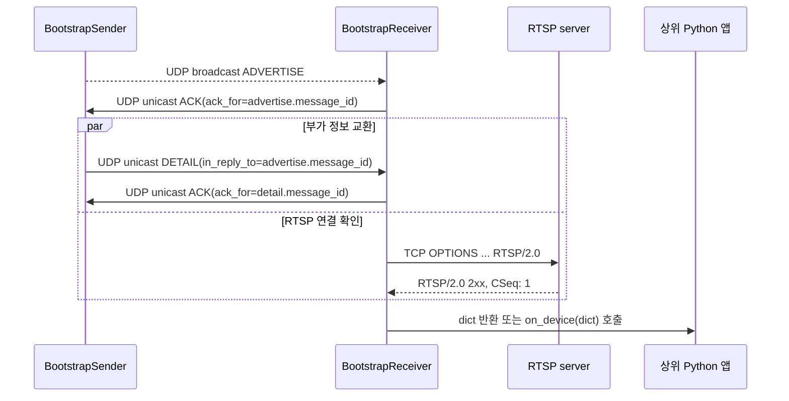

# RTSP Bootstrap

동일한 IPv4 LAN에 있는 송신 장비를 UDP 브로드캐스트로 발견하고, 해당 장비의 RTSP/2.0 접속 가능 여부를 확인한 뒤 연결 정보를 Python 애플리케이션에 전달하는 표준 라이브러리 기반 패키지입니다.

이 프로젝트는 RTSP 영상 탐색·재생 규격이 아니라 **RTSP 연결 정보 부트스트랩 프로토콜**입니다. 영상 디코딩, 화면 출력, 인증, 암호화, 인터넷·서브넷 간 탐색, mDNS와 ONVIF는 범위에 포함하지 않습니다.

## 문서 안내

- [`SRS.md`](SRS.md): 구현해야 할 기능·품질·인터페이스를 정의한 소프트웨어 요구사항 명세서
- [`SDS.md`](SDS.md): 모듈 구조, 상태, 동시성, 알고리즘과 코드 배치를 정의한 소프트웨어 설계 명세서
- [`EASYGUIDE.md`](EASYGUIDE.md): RTSP와 이 패키지를 처음 접하는 학부생을 위한 단계별 원문 안내서
- [`algo.md`](algo.md): 검증, 중복 제거, 상태 갱신, RTSP 확인 알고리즘의 원문 설명
- [`role.md`](role.md): 송신부·수신부·연결부·통합 및 배포 관리의 코드 수준 역할 문서
- [`REALTEST.md`](REALTEST.md): VirtualBox와 실제 MP4 스트림을 이용한 블랙박스 시험 절차

README에는 위 학습 문서의 핵심 내용을 흐름에 맞게 통합했습니다. 각 원문은 상세 참고와 변경 이력 보존을 위해 그대로 유지합니다.

## 1. 먼저 이해할 개념

### 1.1 RTSP란 무엇인가

RTSP(Real Time Streaming Protocol)는 클라이언트가 미디어 서버에 `OPTIONS`, `DESCRIBE`, `SETUP`, `PLAY` 같은 요청을 보내 스트리밍 세션을 제어하는 응용 계층 프로토콜입니다. 이 패키지는 영상을 받거나 재생하지 않고, 다음 `OPTIONS` 요청에 대한 RTSP/2.0 성공 응답까지만 확인합니다.

```text
OPTIONS rtsp://192.168.0.10:8554/stream RTSP/2.0
CSeq: 1

RTSP/2.0 200 OK
CSeq: 1
```

RTSP 제어 연결은 TCP를 사용합니다. 반면 장비 발견과 부가 정보 교환은 이 프로젝트가 정의한 UDP JSON 프로토콜을 사용합니다.

### 1.2 별도의 부트스트랩이 필요한 이유

RTSP URI를 사용하려면 IP, 포트와 경로를 미리 알아야 합니다. 이 패키지는 LAN에 방송되는 `ADVERTISE`를 통해 그 정보를 얻습니다. 수신기는 광고를 보낸 UDP 주소로 `ACK`를 돌려주고, 송신기는 그 주소로 `DETAIL`을 유니캐스트합니다.

### 1.3 세 가지 성공은 서로 다르다

| 결과 | 의미 |
|---|---|
| UDP `ACK` | 유효한 정보를 수신하고 처리했다는 뜻 |
| RTSP probe 성공 | 제한 시간 안에 올바른 RTSP/2.0 2xx 응답을 받았다는 뜻 |
| 영상 재생 성공 | 실제 미디어를 디코딩하고 재생했다는 뜻이며 이 패키지의 범위 밖 |

따라서 `DETAIL`에 대한 `ACK`는 영상 재생 성공을 보장하지 않습니다.

## 2. 전체 동작 흐름



중요한 순서는 다음과 같습니다.

1. 송신기가 `ADVERTISE`를 주기적으로 브로드캐스트합니다.
2. 수신기는 유효한 광고를 장비 ID별로 등록하고 즉시 수신 확인 `ACK`를 보냅니다.
3. 송신기는 ACK의 UDP 출발 주소를 학습하여 `DETAIL`을 유니캐스트합니다.
4. 수신기는 광고와 상관관계가 맞는 `DETAIL`만 반영하고 이에 대한 `ACK`를 보냅니다.
5. 수신기는 동시에 RTSP/2.0 연결을 비동기로 확인합니다.
6. 성공한 연결 정보가 `dict`로 상위 프로그램에 전달됩니다.

## 3. 환경과 범위

- Python 3.12 이상
- IPv4 및 같은 브로드캐스트 도메인의 LAN
- 기본 UDP 부트스트랩 포트: `37020`
- 외부 런타임 의존성 없음
- 패키징: `pyproject.toml` + `src` 레이아웃

신뢰할 수 있는 폐쇄형 LAN을 전제로 합니다. 인증과 암호화가 없으므로 공용망에 직접 노출하지 마십시오. 호스트 방화벽에서는 UDP 부트스트랩 포트와 장비가 사용하는 RTSP TCP 포트를 허용해야 합니다.

## 4. 설치

프로젝트 루트에서 다음을 실행합니다.

```powershell
python --version
python -m pip install .
```

개발 중 소스 변경을 즉시 반영하려면 editable 설치를 사용합니다.

```powershell
python -m pip install -e .
```

여러 Python이 설치된 Windows에서는 실제 실행기를 명시하는 편이 안전합니다.

```powershell
py -3.12 --version
py -3.12 -m pip install -e .
py -3.12 -c "import sys, rtsp_bootstrap; print(sys.executable); print(rtsp_bootstrap.__file__)"
```

개발과 CI에서는 같은 3.12 마이너 버전을 고정하기보다 최신 보안·버그 수정이 적용된 Python 3.12 패치 버전을 권장합니다. 특정 재현이 필요할 때만 예를 들어 3.12.7처럼 정확한 패치 버전을 함께 기록합니다.

## 5. 가장 작은 로컬 실습

로컬 실습은 터미널 세 개를 사용합니다. 이 예제의 가짜 RTSP 서버는 영상 송출기가 아니라 RTSP/2.0 `OPTIONS` 확인만 통과시키는 테스트 더블입니다.

### 5.1 터미널 A: 가짜 RTSP 서버

`tmp/fake_rtsp.py`를 다음처럼 실행합니다.

```powershell
python .\tmp\fake_rtsp.py
```

핵심 코드는 다음과 같습니다.

```python
import socket


with socket.socket(socket.AF_INET, socket.SOCK_STREAM) as server:
    server.setsockopt(socket.SOL_SOCKET, socket.SO_REUSEADDR, 1)
    server.bind(("127.0.0.1", 8554))
    server.listen()
    print("fake RTSP server: rtsp://127.0.0.1:8554/stream")

    while True:
        connection, peer = server.accept()
        with connection:
            request = b""
            while b"\r\n\r\n" not in request and len(request) < 16_384:
                chunk = connection.recv(4096)
                if not chunk:
                    break
                request += chunk

            first_line = request.split(b"\r\n", 1)[0]
            print(peer, first_line.decode("ascii", errors="replace"))
            connection.sendall(
                b"RTSP/2.0 200 OK\r\n"
                b"CSeq: 1\r\n"
                b"Content-Length: 0\r\n"
                b"\r\n"
            )
```

### 5.2 터미널 B: 수신기

```powershell
python -m rtsp_bootstrap receiver --bind 127.0.0.1 --port 37020 --rtsp-timeout 2 --duration 10
```

### 5.3 터미널 C: 송신기

```powershell
python -m rtsp_bootstrap sender --device-id camera-01 --ip 127.0.0.1 --rtsp-port 8554 --rtsp-path /stream --broadcast-address 127.0.0.1 --interval 1 --detail-json '{"model":"study-camera"}'
```

성공하면 다음 현상을 확인할 수 있습니다.

- 가짜 RTSP 서버에 `OPTIONS rtsp://127.0.0.1:8554/stream RTSP/2.0`이 표시됩니다.
- 수신기 stdout에 장비 정보가 JSON 한 줄로 출력됩니다.
- 송신기는 광고 ACK와 DETAIL ACK를 처리합니다.

종료는 각 터미널에서 `Ctrl+C`를 누릅니다. `Address already in use`가 나오면 이전 프로세스가 8554 또는 37020 포트를 사용 중인지 확인하십시오.

## 6. 실제 LAN CLI 사용

송신 장비에서 다음과 같이 실행합니다. `--ip`는 수신 호스트가 접근할 수 있는 장비의 LAN IPv4 주소여야 합니다.

```powershell
rtsp-bootstrap-sender --device-id camera-01 --ip 192.168.0.10 --rtsp-port 8554 --rtsp-path /stream --detail-json '{"model":"demo-camera","location":"lab"}'
```

같은 LAN의 수신 호스트에서 실행합니다.

```powershell
rtsp-bootstrap-receiver --bind 0.0.0.0 --port 37020 --rtsp-timeout 2
```

모듈 실행도 동일합니다.

```powershell
python -m rtsp_bootstrap sender --help
python -m rtsp_bootstrap receiver --help
```

수신기 stdout에는 성공 장비가 UTF-8 JSON Lines 형식으로 기록되고 진단 로그는 stderr로 분리됩니다. 자동화에서는 stdout의 한 줄을 하나의 JSON 객체로 읽으면 됩니다.

## 7. Python API

대표 공개 API는 `BootstrapSender`, `BootstrapReceiver`, `PROTOCOL_VERSION`입니다. 메시지 codec과 RTSP probe를 직접 시험하거나 확장할 수 있도록 `MessageType`, `MessageError`, `make_message()`, `encode_message()`, `decode_message()`, `validate_message()`, `build_rtsp_uri()`, `probe_rtsp()`도 최상위 패키지에서 제공합니다.

### 7.1 제한 시간 동안 발견 결과 반환

```python
from rtsp_bootstrap import BootstrapReceiver


with BootstrapReceiver(bind_host="0.0.0.0", port=37020) as receiver:
    devices = receiver.discover(timeout=10.0)

for device in devices:
    print(device["device_id"], device["rtsp_uri"])
```

`discover(timeout)`은 **그 호출 시간 구간에 유효한 메시지를 받은 뒤 RTSP 확인에 성공한 장비**를 반환합니다. 예전 호출에서 발견했지만 이번 구간에 다시 보이지 않은 장비는 반환하지 않습니다.

### 7.2 콜백으로 계속 수신

```python
from rtsp_bootstrap import BootstrapReceiver


def ready(info: dict[str, object]) -> None:
    print(info["rtsp_uri"], info["details"])


with BootstrapReceiver(on_device=ready) as receiver:
    receiver.serve_forever()
```

콜백은 수신기의 I/O 스레드에서 호출됩니다. 오래 걸리는 작업은 별도 큐로 넘기고, 여러 스레드에서 공유하는 데이터는 호출자가 동기화해야 합니다. 콜백 예외는 수신 루프를 종료하지 않으며, 콜백 안에서 `receiver.stop()`을 호출해도 안전합니다.

RTSP 성공 직후 한 번, 뒤이어 유효한 DETAIL로 공개 정보가 바뀌면 다시 한 번 호출될 수 있습니다. 따라서 콜백은 여러 번 호출되어도 안전하게 작성하십시오.

### 7.3 송신기 임베딩

```python
from rtsp_bootstrap import BootstrapSender


with BootstrapSender(
    device_id="camera-01",
    ip="192.168.0.10",
    rtsp_port=8554,
    rtsp_path="/stream",
    details={"model": "demo-camera"},
) as sender:
    sender.serve_forever()
```

### 7.4 최신 상태 조회

```python
all_devices = receiver.get_devices()
camera = all_devices.get("camera-01")
```

`get_devices()`에는 RTSP 확인에 실패한 장비도 포함될 수 있으며 `rtsp_connected`로 구분합니다. 반환값은 내부 상태를 바꿀 수 없도록 깊은 복사본입니다.

대표 결과는 다음과 같습니다.

```python
{
    "protocol_version": "1.0",
    "device_id": "camera-01",
    "message_id": "8edce1bb-...",
    "ip": "192.168.0.10",
    "rtsp_port": 8554,
    "rtsp_path": "/stream",
    "rtsp_uri": "rtsp://192.168.0.10:8554/stream",
    "details": {"model": "demo-camera", "location": "lab"},
    "rtsp_connected": True,
    "last_seen": 1750000000.0,
}
```

## 8. 부트스트랩 프로토콜

모든 메시지는 UTF-8 JSON 객체이며 `protocol_version`은 현재 `"1.0"`입니다. `message_type`은 `ADVERTISE`, `DETAIL`, `ACK` 중 하나입니다.

### 8.1 공통 필드

| 필드 | 형식 | 설명 |
|---|---|---|
| `protocol_version` | 문자열 | 현재 `1.0` |
| `message_type` | 문자열 | `ADVERTISE`, `DETAIL`, `ACK` |
| `device_id` | 문자열 | 장비의 안정적인 고유 ID |
| `message_id` | 문자열 | 메시지마다 새로 만드는 고유 ID |
| `ip` | 문자열 | 수신측에서 접근 가능한 IPv4 주소 |
| `rtsp_port` | 정수 | 1–65535 |
| `rtsp_path` | 문자열 | `/`로 시작하는 RTSP 경로 |

광고 예시는 다음과 같습니다.

```json
{
  "protocol_version": "1.0",
  "message_type": "ADVERTISE",
  "device_id": "camera-01",
  "message_id": "advertise-uuid",
  "ip": "192.168.0.10",
  "rtsp_port": 8554,
  "rtsp_path": "/stream"
}
```

`DETAIL`은 위 필드에 `details` 객체와 `in_reply_to`를 추가합니다. `in_reply_to`는 어느 광고에 대한 상세 정보인지 나타냅니다. `ACK`은 `ack_for`로 확인 대상 메시지 ID를 지정합니다.

### 8.2 중복과 순서 뒤바뀜

UDP는 전달, 순서, 중복 방지를 보장하지 않습니다. 구현은 다음 규칙으로 이를 흡수합니다.

- `device_id`를 레지스트리 키로 사용하여 여러 장비를 구분합니다.
- 같은 `message_id`를 다시 받아도 상태·콜백은 중복 반영하지 않습니다.
- 중복 DETAIL에도 ACK는 다시 보내 송신기가 ACK 유실에서 복구할 수 있게 합니다.
- DETAIL은 광고 문맥과 장비·endpoint가 일치할 때만 반영합니다.
- 같은 endpoint에서 광고 순서가 뒤바뀌는 정상 상황은 허용하되, 이전 endpoint의 늦은 DETAIL이 최신 상태를 되돌리는 것은 막습니다.
- 중복 캐시는 상한을 두어 장시간 실행 중 메모리가 무한히 늘지 않게 합니다.

## 9. RTSP/2.0 연결 확인

기본 probe는 광고된 URI로 TCP 연결을 열고 `OPTIONS` 요청을 보냅니다. 다음 조건을 모두 충족해야 성공입니다.

1. 지정된 단일 제한 시간 안에 연결·송신·응답 수신이 완료됩니다.
2. 헤더 끝 `\r\n\r\n`까지 완전하게 받습니다.
3. 상태 줄의 버전이 정확히 `RTSP/2.0`입니다.
4. 상태 코드가 200–299입니다.
5. 응답 `CSeq`가 요청의 `1`과 일치합니다.
6. 최대 헤더 크기 16,384바이트를 넘지 않습니다.

TCP 연결만 성공하거나 RTSP/1.0 응답을 받는 경우는 실패입니다. 이 엄격한 기준 때문에 일반 MP4 송출 도구가 RTSP/1.0만 제공한다면 기본 probe와 호환되지 않을 수 있습니다. 그런 서버까지 수용하려면 정책 변경과 별도 요구사항 합의가 필요합니다.

## 10. 핵심 알고리즘과 동시성

### 10.1 수신 데이터그램 처리

```text
receive(datagram, peer)
  message = strict_decode_and_validate(datagram)
  if invalid: ignore without stopping listener

  if ADVERTISE:
    register latest device state by device_id
    send ACK immediately
    accept a correlated DETAIL later
    schedule bounded asynchronous RTSP probe

  if DETAIL:
    validate advertisement context and endpoint epoch
    if duplicate: resend ACK only
    else: merge details under the details key, then send ACK

  if RTSP result is current and successful:
    publish a deep-copied dict to callback/discover
```

### 10.2 송신 처리

```text
repeat every interval:
  create unique ADVERTISE message_id
  register it before sending
  broadcast ADVERTISE

on correlated advertisement ACK from peer:
  create DETAIL with in_reply_to
  register pending DETAIL before sending
  unicast DETAIL to peer

on correlated DETAIL ACK:
  mark the pending transmission acknowledged
  notify waiters and optional callback
```

### 10.3 왜 RTSP를 worker에서 확인하는가

RTSP 연결은 네트워크 제한 시간까지 오래 걸릴 수 있습니다. UDP 수신 스레드가 직접 기다리면 다른 장비의 광고와 ACK를 놓칠 수 있으므로 제한된 worker pool에서 수행합니다. 대기 probe 수도 제한하여 장비가 많거나 악성 광고가 들어와도 자원 사용량을 제어합니다.

probe 결과에는 실행 세대, 장비 ID, endpoint와 token이 붙습니다. 결과가 돌아왔을 때 현재 상태와 다르면 폐기하여 오래된 성공 결과가 새 endpoint를 덮지 않게 합니다.

### 10.4 유지해야 하는 불변식

- 공개 장비 레지스트리에는 `device_id`당 하나의 최신 상태만 존재합니다.
- 잘못된 JSON과 예상 밖 네트워크 오류가 서비스 루프를 종료하지 않습니다.
- ACK는 메시지 수신 확인이며 RTSP 또는 영상 재생 결과와 결합하지 않습니다.
- 송신 대기자는 중지·재시작 세대를 넘어 새 실행에 붙잡혀 있지 않습니다.
- 외부 콜백은 내부 lock을 잡은 채 실행하지 않습니다.

더 자세한 알고리즘은 [`algo.md`](algo.md), 구현 구조와 자료구조는 [`SDS.md`](SDS.md)를 참고하십시오.

## 11. 소스 구조와 4인 역할

```text
src/rtsp_bootstrap/
├── __init__.py      공개 API와 버전
├── __main__.py      python -m 진입점
├── cli.py           sender/receiver CLI
├── protocol.py      JSON 생성·직렬화·검증
├── rtsp.py          RTSP URI 생성과 OPTIONS probe
├── sender.py        광고·DETAIL·ACK 추적
├── receiver.py      장비 상태·중복 제거·probe·콜백
└── py.typed          타입 정보 배포 표지
```

프로젝트의 본래 4인 분담은 코드 경계를 기준으로 다음처럼 정리할 수 있습니다.

| 역할 | 주요 코드 | 기술적 책임 |
|---|---|---|
| 송신부 개발 | `sender.py` | 주기 광고, peer 학습, DETAIL 유니캐스트, ACK 상관관계와 실행 세대 |
| 수신부 개발 | `receiver.py` | UDP 수신, 장비 레지스트리, 중복·재정렬 처리, callback/discover |
| 연결부 개발 | `protocol.py`, `rtsp.py` | wire schema와 엄격한 검증, RTSP URI, RTSP/2.0 probe |
| 통합·배포 관리 | `cli.py`, `__main__.py`, `__init__.py`, `pyproject.toml`, 테스트·문서 | 공개 API, CLI, 패키징, 릴리스 및 회귀 시험 |

모든 역할은 메시지 필드, ACK 의미, 예외 정책처럼 경계를 넘는 계약을 [`SRS.md`](SRS.md)와 [`SDS.md`](SDS.md)로 합의해야 합니다. 자세한 코드 수준 분담은 [`role.md`](role.md)에 있습니다.

## 12. 자동 테스트

표준 라이브러리 `unittest`로 실행합니다.

```powershell
python -m unittest discover -s tests -v
```

| 테스트 파일 | 검증 범위 |
|---|---|
| `test_protocol.py` | 메시지 생성·직렬화·필드 검증과 비정상 JSON |
| `test_rtsp.py` | RTSP/2.0 응답, 분할 응답, CSeq·버전·timeout |
| `test_sender.py` | 광고와 DETAIL, ACK 상관관계, 중복·재시작 |
| `test_receiver.py` | 상태 갱신, 중복, 재정렬, probe 제한, callback와 discover |
| `test_e2e.py` | UDP 광고부터 DETAIL ACK와 RTSP 성공까지 전체 절차 |
| `test_cli.py` | 인자 검증, 시작 오류, UTF-8 JSON Lines 출력 |

테스트는 외부 카메라나 인터넷 없이 loopback socket과 가짜 RTSP 서버를 사용합니다. 단위·통합 테스트 통과는 실제 LAN 방화벽, 브로드캐스트 정책과 실제 RTSP 장비의 호환성까지 보장하지 않으므로 최종 블랙박스 시험을 별도로 수행해야 합니다.

## 13. VirtualBox 블랙박스 시험

VirtualBox 시험은 올바른 최종 검증 방법입니다. 다만 목적을 둘로 나누어야 합니다.

### 13.1 프로토콜 전체 절차 시험

게스트 VM에서 RTSP/2.0 서버와 `BootstrapSender`를 실행하고 호스트에서 `BootstrapReceiver`를 실행합니다. 어댑터는 호스트와 게스트가 같은 브로드캐스트 도메인에 있도록 브리지 모드를 우선 사용합니다. 이 시험은 다음을 확인합니다.

- 실제 NIC를 통한 UDP 브로드캐스트 발견
- ADVERTISE ACK, DETAIL, DETAIL ACK의 유니캐스트 교환
- 게스트 RTSP TCP 포트 접속
- 수신 결과 dict와 여러 장비 분리
- 프로세스 종료·재시작과 timeout 복구

### 13.2 MP4를 실시간처럼 송출하는 미디어 시험

FFmpeg의 `-re` 옵션과 MediaMTX 같은 RTSP 서버로 MP4를 실시간 속도로 반복 송출할 수 있습니다. 이 시험은 URI가 실제 스트림을 가리키는지 VLC나 ffprobe 같은 별도 클라이언트로 확인하는 용도입니다.

그러나 서버가 RTSP/1.0만 응답하면 본 패키지의 엄격한 RTSP/2.0 probe는 실패하는 것이 정상입니다. 따라서 다음 두 결과를 따로 기록하십시오.

| 시험 | 합격 기준 |
|---|---|
| Bootstrap 적합성 | 수신기가 RTSP/2.0 2xx를 확인하고 연결 dict를 전달 |
| 미디어 재생성 | 외부 플레이어가 MP4 기반 스트림을 실제로 재생 |

VM IP, 방화벽, 브리지 설정, FFmpeg·서버 명령, 정상·장애 시나리오와 합격표는 [`REALTEST.md`](REALTEST.md)에 자세히 정리되어 있습니다.

## 14. 문제 해결

### 수신기에 아무것도 나타나지 않음

- 송신기와 수신기의 UDP 포트가 같은지 확인합니다.
- 로컬 실습에서는 `--broadcast-address 127.0.0.1`을 사용합니다.
- LAN에서는 두 호스트가 같은 브로드캐스트 도메인인지 확인합니다.
- Windows 방화벽에서 UDP 37020 인바운드를 허용합니다.
- 가상 머신 NAT는 브로드캐스트를 기대대로 전달하지 않을 수 있으므로 브리지 모드를 확인합니다.

### 광고는 오지만 RTSP가 실패함

- 광고의 `ip`, `rtsp_port`, `rtsp_path`를 직접 점검합니다.
- 서버가 `127.0.0.1`에만 bind되어 있으면 다른 호스트에서 접근할 수 없습니다. LAN 시험에서는 게스트의 LAN 주소 또는 `0.0.0.0`에 bind합니다.
- RTSP TCP 포트가 방화벽에 허용되어 있는지 확인합니다.
- 응답이 RTSP/2.0인지, 2xx인지, `CSeq: 1`인지 확인합니다.

### `Address already in use`

동일 포트의 이전 프로세스를 종료하거나 다른 UDP/RTSP 포트를 지정합니다. 부트스트랩 UDP 포트와 RTSP TCP 포트는 서로 다른 용도입니다.

### 다른 Python 또는 패키지가 실행됨

```powershell
python -c "import sys, rtsp_bootstrap; print(sys.executable); print(rtsp_bootstrap.__file__)"
python -m pip show rtsp-bootstrap
```

설치에 사용한 인터프리터와 실행 인터프리터가 같은지 확인합니다.

## 15. 개발 및 배포 확인 목록

변경 전후에 다음을 확인합니다.

1. Python 3.12 환경에서 전체 테스트를 실행합니다.
2. wheel과 sdist를 빌드하고 새 가상환경에 wheel을 설치합니다.
3. 두 console script와 `python -m rtsp_bootstrap`을 smoke test합니다.
4. 메시지 schema가 바뀌면 protocol version과 SRS/SDS/README를 함께 검토합니다.
5. 실제 동일 LAN에서 브로드캐스트, DETAIL ACK와 RTSP/2.0을 확인합니다.
6. 로그에 민감 정보가 포함되지 않는지, 공용망에 노출되지 않는지 확인합니다.

현재 배포 메타데이터와 정확한 공개 계약은 [`pyproject.toml`](pyproject.toml), 요구사항 추적성은 [`SRS.md`](SRS.md), 구현 결정은 [`SDS.md`](SDS.md)를 기준으로 합니다.

## 라이선스

이 프로젝트의 라이선스는 [`LICENSE`](LICENSE)를 참고하십시오.
