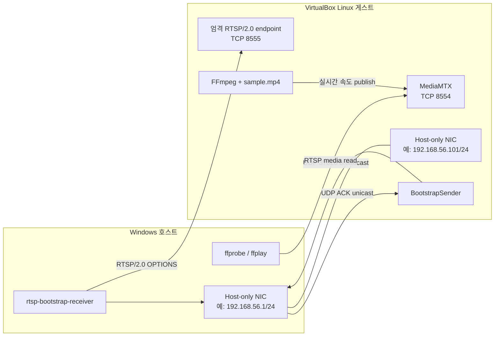

# VirtualBox 기반 실제 블랙박스 테스트

## 1. 결론

VirtualBox 게스트에서 MP4 파일을 실시간 스트림처럼 RTSP로 송출하고, 호스트에서 이 패키지로 장비를 발견하는 시험은 **가치 있는 최종 시스템 테스트**다. 실제 UDP/TCP socket, 가상 NIC, broadcast domain, 방화벽, 패키지 설치본과 외부 RTSP 서버를 함께 통과하기 때문이다.

다만 이 시험 하나만으로 최종 합격을 선언하면 안 된다.

1. 이 프로젝트의 기본 probe는 `RTSP/2.0 OPTIONS`에 대한 `RTSP/2.0 2xx`와 동일한 `CSeq`만 성공으로 인정한다.
2. MP4 송출에 흔히 사용하는 FFmpeg + MediaMTX 조합은 실제 미디어 시험에는 적합하지만, MediaMTX의 공식 사례와 로그는 RTSP/1.0 교환을 보여준다.
3. 영상 재생은 이 모듈의 범위 밖이고, 이 모듈이 보장하는 것은 검증된 RTSP 연결정보 전달까지다.

따라서 최종 승인은 다음 두 게이트로 나눈다.

| 게이트 | 목적 | 최종 판정에서의 위치 |
|---|---|---|
| A. 엄격 RTSP/2.0 Bootstrap | 기본 probe, UDP 발견, DETAIL/ACK, callback dict 검증 | 패키지 요구사항 합격에 필수 |
| B. MP4 실시간 RTSP 미디어 | 실제 MP4 반복 송출, URI 접근과 영상·프레임 확인 | 시스템 현실성 확인용; 제품이 재생 가능 URI까지 주장하면 필수 |

RTSP/2.0으로 실제 미디어까지 제공하는 서버를 확보했다면 두 게이트를 하나로 합칠 수 있다. 그렇지 않다면 RTSP/1.0 미디어 서버를 통과시키기 위해 기본 probe를 임의로 느슨하게 바꾸지 않는다. RTSP 1.0도 제품 요구사항에 포함하려면 먼저 요구사항과 protocol version 정책을 별도로 변경해야 한다.

## 2. 테스트 목표

이 문서의 절차는 다음을 검증한다.

- 설치된 wheel에서 송신기와 수신기 CLI/API가 실행되는가?
- VirtualBox 가상 LAN에서 ADVERTISE broadcast가 호스트에 도달하는가?
- 수신기의 유니캐스트 ACK를 송신기가 받고 DETAIL을 전송하는가?
- 수신기가 DETAIL ACK를 보내는가?
- 기본 probe가 실제 TCP 연결과 RTSP/2.0 응답을 검사하는가?
- RTSP가 꺼진 상태에서는 성공 결과가 나오지 않고, 켜지면 재발견되는가?
- 서로 다른 `device_id`를 가진 두 송신기가 분리되는가?
- 실제 MP4가 `-re` 속도로 반복 송출되고 외부 도구에서 읽히는가?

다음은 이 테스트의 범위가 아니다.

- 영상 화질 평가
- 장시간 부하·내구성 시험
- 인터넷 또는 서로 다른 subnet 사이의 발견
- 인증·암호화
- 특정 카메라 제조사의 RTSP 호환성 인증

## 3. 블랙박스 원칙

엄격 게이트에서는 다음 원칙을 지킨다.

- `src/`를 `PYTHONPATH`로 직접 import하지 않고 빌드된 wheel을 설치한다.
- `tests.support`와 private 메서드를 사용하지 않는다.
- 송신기에는 공개 `BootstrapSender` API만 사용한다.
- 수신기는 기본 `rtsp_probe`를 사용하는 공개 CLI로 실행한다.
- 합격 여부는 receiver stdout, sender의 `on_detail_ack`, 독립 RTSP 서버 로그로 판단한다.
- 패킷 교환 중 코드를 수정하거나 요구조건을 낮추지 않는다.

MP4 미디어 게이트에서 사용하는 FFmpeg, ffprobe, MediaMTX는 테스트 대상이 아니라 독립 외부 시스템이다.

## 4. 권장 테스트 구성



예시 주소는 실제 환경에 맞게 바꾼다.

| 항목 | 예시 |
|---|---|
| 호스트 Host-only IP | `192.168.56.1` |
| 게스트 Host-only IP | `192.168.56.101` |
| netmask | `255.255.255.0` |
| directed broadcast | `192.168.56.255` |
| UDP bootstrap port | `37020` |
| 엄격 RTSP/2.0 시험 port | `8555` |
| MP4 MediaMTX port | `8554` |
| RTSP path | `/blackbox` |

## 5. VirtualBox 네트워크 설정

### 5.1 재현 가능한 1차 시험: Host-only Adapter

VirtualBox Host-only 네트워크는 호스트와 VM을 물리 Ethernet switch에 연결된 것처럼 통신시키면서 외부 LAN과는 분리한다. 따라서 첫 블랙박스 시험에 적합하다.

VM을 종료한 뒤 VirtualBox 설정에서 다음처럼 구성한다.

1. `Network → Adapter 1`: `NAT`
   - 패키지와 도구를 내려받는 용도다.
2. `Network → Adapter 2`: `Host-only Adapter`
   - 실제 테스트 트래픽 전용이다.
3. Host-only interface를 선택한다.
4. `Cable Connected`를 활성화한다.

NAT adapter 하나만 사용하면 guest가 host LAN의 동일 broadcast domain에 직접 참여하지 않으므로 이 발견 시험에 적합하지 않다.

게스트 Linux에서 실제 주소를 확인한다.

```console
ip -4 -brief address
ip route
```

호스트 PowerShell에서 확인한다.

```powershell
Get-NetIPAddress -AddressFamily IPv4 | Format-Table InterfaceAlias,IPAddress,PrefixLength
```

`192.168.56.0/24`는 흔한 예일 뿐이다. 출력된 IP와 prefix를 기준으로 directed broadcast 주소를 계산한다. `/24`라면 마지막 octet이 `255`인 주소가 broadcast다.

### 5.2 실제 LAN 2차 시험: Bridged Adapter

Host-only 시험을 통과한 뒤 제품이 실제 동일 LAN에서 사용될 예정이라면 Adapter 2를 `Bridged Adapter`로 바꾸고 같은 시험을 반복한다. 게스트가 실제 LAN IP를 받고 다른 장비처럼 보이므로 AP client isolation, Wi-Fi bridge 제한, 실제 방화벽 정책까지 확인할 수 있다.

공용 또는 신뢰할 수 없는 LAN에서는 실행하지 않는다. 이 bootstrap protocol은 인증과 암호화를 제공하지 않는다.

## 6. 사전 준비

### 6.1 필요한 항목

- 호스트와 게스트의 Python 3.12 이상
- VirtualBox와 Linux 게스트
- 테스트할 프로젝트 소스
- 개인정보·저작권 문제가 없는 짧은 MP4 파일
- FFmpeg와 ffprobe
- MediaMTX 실행 파일
- 호스트에서 UDP 37020 수신 권한
- 게스트에서 TCP 8554, 8555 수신 권한

MP4 파일명은 이 문서에서 `/home/student/sample.mp4`로 가정한다.

### 6.2 버전과 시험 대상 기록

호스트 PowerShell:

```powershell
VBoxManage --version
py -3.12 --version
git rev-parse HEAD
```

게스트 Linux:

```console
python3.12 --version
ffmpeg -version
ffprobe -version
./mediamtx --version
```

### 6.3 방화벽

호스트에서 receiver가 처음 실행될 때 Python의 네트워크 접근을 허용한다. 먼저 실제 VirtualBox interface alias와 network profile을 확인한다.

```powershell
Get-NetAdapter | Where-Object Name -Like "*VirtualBox*"
Get-NetConnectionProfile
```

필요하다면 관리자 PowerShell에서 테스트 전용 규칙을 만든다. 아래 interface alias와 subnet은 실제 출력값으로 교체한다.

```powershell
New-NetFirewallRule -DisplayName "RTSP Bootstrap Real Test UDP 37020" -Direction Inbound -Protocol UDP -LocalPort 37020 -RemoteAddress 192.168.56.0/24 -InterfaceAlias "VirtualBox Host-Only Ethernet Adapter" -Action Allow
```

시험이 끝난 뒤 이 문서에서 만든 규칙만 제거할 수 있다.

```powershell
Remove-NetFirewallRule -DisplayName "RTSP Bootstrap Real Test UDP 37020"
```

게스트 방화벽에는 Host-only subnet에서 오는 TCP 8554와 8555만 허용한다. 방화벽을 전부 비활성화하지 않는다.

## 7. wheel 빌드와 설치

### 7.1 호스트

프로젝트 루트의 PowerShell에서 실행한다.

```powershell
py -3.12 -m venv .venv-realtest
.\.venv-realtest\Scripts\Activate.ps1
python -m pip install --upgrade pip
python -m pip wheel . --no-deps --wheel-dir .\realtest-dist
$realtestWheel = Get-ChildItem .\realtest-dist\rtsp_bootstrap-*.whl | Select-Object -First 1
python -m pip install --force-reinstall $realtestWheel.FullName
rtsp-bootstrap-receiver --help
```

생성한 wheel을 VirtualBox shared folder 또는 `scp`로 게스트에 복사한다.

### 7.2 게스트

게스트에서 wheel 파일이 현재 디렉터리에 있다고 가정한다.

```console
python3.12 -m venv .venv-realtest
source .venv-realtest/bin/activate
python -m pip install ./rtsp_bootstrap-0.1.0-py3-none-any.whl
rtsp-bootstrap-sender --help
```

실제 wheel 파일명이 다르면 그 이름을 사용한다. 블랙박스 시험 전에 자동 테스트도 별도로 통과시킨다.

```console
python -m unittest discover -s tests -v
```

## 8. 공통 송신 관찰 프로그램

CLI sender는 정상 DETAIL ACK를 stdout에 출력하지 않는다. 최종 시험에서 ACK 증거를 남기기 위해 공개 API와 `on_detail_ack` callback만 사용하는 다음 파일을 게스트에 `vm_sender.py`로 만든다.

```python
import json
import os

from rtsp_bootstrap import BootstrapSender


device_id = os.environ.get("DEVICE_ID", "vm-camera-01")
guest_ip = os.environ["GUEST_IP"]
broadcast_ip = os.environ["BROADCAST_IP"]
rtsp_port = int(os.environ.get("RTSP_PORT", "8555"))
rtsp_path = os.environ.get("RTSP_PATH", "/blackbox")


def detail_ack(record: dict[str, object]) -> None:
    print(
        "DETAIL_ACK " + json.dumps(record, ensure_ascii=False, sort_keys=True),
        flush=True,
    )


sender = BootstrapSender(
    device_id=device_id,
    ip=guest_ip,
    rtsp_port=rtsp_port,
    rtsp_path=rtsp_path,
    details={
        "scenario": os.environ.get("SCENARIO", "strict-rtsp2"),
        "source": "virtualbox",
    },
    discovery_port=37020,
    broadcast_address=broadcast_ip,
    advertise_interval=1.0,
    on_detail_ack=detail_ack,
)

try:
    sender.serve_forever()
finally:
    sender.stop()
```

이 파일은 private API나 테스트 helper를 사용하지 않으므로 설치된 패키지의 공개 API를 대상으로 한다.

## 9. 게이트 A — 엄격 RTSP/2.0 Bootstrap 시험

### 9.1 독립 RTSP/2.0 endpoint 준비

게스트에 `strict_rtsp2_endpoint.py`를 만든다. 이 서버는 실제 영상을 제공하지 않고 이 모듈의 범위인 `RTSP/2.0 OPTIONS` 연결 확인만 독립적으로 제공한다.

```python
import socketserver


class Rtsp2Handler(socketserver.StreamRequestHandler):
    def handle(self) -> None:
        self.connection.settimeout(3.0)
        request = bytearray()
        try:
            while b"\r\n\r\n" not in request and len(request) < 16_384:
                chunk = self.connection.recv(4096)
                if not chunk:
                    return
                request.extend(chunk)
        except (OSError, TimeoutError):
            return

        header = bytes(request).split(b"\r\n\r\n", 1)[0]
        lines = header.split(b"\r\n")
        request_line = lines[0].decode("ascii", errors="replace")
        headers: dict[str, str] = {}
        for line in lines[1:]:
            name, separator, value = line.partition(b":")
            if separator:
                headers[name.decode("ascii").strip().lower()] = (
                    value.decode("ascii").strip()
                )

        valid = (
            request_line.startswith("OPTIONS rtsp://")
            and request_line.endswith(" RTSP/2.0")
            and headers.get("cseq") == "1"
        )
        status = "200 OK" if valid else "400 Bad Request"
        response = (
            f"RTSP/2.0 {status}\r\n"
            f"CSeq: {headers.get('cseq', '0')}\r\n"
            "Public: OPTIONS\r\n"
            "\r\n"
        ).encode("ascii")
        self.connection.sendall(response)
        print(self.client_address, request_line, status, flush=True)


class Rtsp2Server(socketserver.ThreadingTCPServer):
    allow_reuse_address = True
    daemon_threads = True


with Rtsp2Server(("0.0.0.0", 8555), Rtsp2Handler) as server:
    print("strict RTSP/2.0 endpoint listening on TCP 8555", flush=True)
    try:
        server.serve_forever()
    except KeyboardInterrupt:
        pass
```

실행한다.

```console
python3.12 strict_rtsp2_endpoint.py | tee strict-rtsp2.log
```

이 endpoint는 테스트 대상 패키지를 import하지 않는다. 따라서 대상 코드와 독립된 네트워크 상대 역할을 한다.

### 9.2 호스트 receiver 실행

호스트 PowerShell에서 실행한다.

```powershell
rtsp-bootstrap-receiver --bind 0.0.0.0 --port 37020 --rtsp-timeout 2 --log-level DEBUG 2>&1 | Tee-Object receiver-strict.log
```

위 명령은 수동 확인을 위해 stdout과 stderr를 한 파일에 합친다. JSON Lines를 프로그램으로 파싱할 때는 stdout과 stderr를 별도 파일로 저장한다.

### 9.3 게스트 sender 실행

게스트의 실제 Host-only 주소와 broadcast 주소를 설정한다.

```console
export DEVICE_ID=vm-camera-01
export GUEST_IP=192.168.56.101
export BROADCAST_IP=192.168.56.255
export RTSP_PORT=8555
export RTSP_PATH=/blackbox
export SCENARIO=strict-rtsp2
python3.12 vm_sender.py | tee sender-strict.log
```

### 9.4 필수 관찰 결과

게스트의 `strict-rtsp2.log`에는 다음 형태가 나타나야 한다.

```text
('192.168.56.1', 임시포트) OPTIONS rtsp://192.168.56.101:8555/blackbox RTSP/2.0 200 OK
```

게스트의 `sender-strict.log`에는 최소 하나의 다음 이벤트가 있어야 한다.

```text
DETAIL_ACK {...}
```

이벤트 내부에서 다음 관계를 확인한다.

```text
record["ack"]["ack_for"] == record["message_id"]
```

호스트의 receiver 출력에는 결국 다음 값을 가진 JSON이 나타나야 한다.

```json
{
  "device_id": "vm-camera-01",
  "ip": "192.168.56.101",
  "rtsp_port": 8555,
  "rtsp_path": "/blackbox",
  "rtsp_uri": "rtsp://192.168.56.101:8555/blackbox",
  "details": {
    "scenario": "strict-rtsp2",
    "source": "virtualbox"
  },
  "rtsp_connected": true
}
```

실제 JSON에는 `protocol_version`, `message_id`, `last_seen`도 포함된다. RTSP probe가 DETAIL보다 먼저 끝나면 첫 JSON의 `details`가 `{}`일 수 있고, DETAIL 도착 후 갱신 JSON이 추가로 출력되는 것은 정상이다.

### 9.5 실패 후 복구 시험

더 명확한 의미 분리 시험은 endpoint를 끈 상태에서 시작한다.

1. receiver와 sender만 먼저 실행한다.
2. sender에는 `DETAIL_ACK`가 나타나는지 확인한다.
3. receiver에는 RTSP 성공 장비 JSON이 나오지 않는지 확인한다.
4. `strict_rtsp2_endpoint.py`를 실행한다.
5. 다음 광고와 probe 뒤 receiver에 성공 JSON이 나타나는지 확인한다.

DETAIL ACK는 JSON 정보 수신 완료이고 RTSP 성공이 아니라는 요구사항을 실제로 보여주는 절차다.

성공 후 endpoint 장애와 복구까지 보려면 endpoint를 종료하고 기본 성공 TTL인 10초보다 오래 기다린다. 재검증 실패 후 endpoint를 다시 켰을 때 성공 callback이 다시 발생해야 한다.

### 9.6 두 장비 시험

게스트의 다른 terminal에서 같은 endpoint를 사용하되 ID를 바꿔 두 번째 sender를 실행한다.

```console
export DEVICE_ID=vm-camera-02
export GUEST_IP=192.168.56.101
export BROADCAST_IP=192.168.56.255
export RTSP_PORT=8555
export RTSP_PATH=/blackbox
export SCENARIO=second-device
python3.12 vm_sender.py | tee sender-second.log
```

receiver 출력에서 `vm-camera-01`과 `vm-camera-02`가 별도 장비로 나타나야 한다.

### 9.7 잘못된 패킷 뒤 생존 시험

게스트에서 잘못된 JSON 하나를 broadcast한다.

```console
python3.12 -c 'import socket; s=socket.socket(socket.AF_INET,socket.SOCK_DGRAM); s.setsockopt(socket.SOL_SOCKET,socket.SO_BROADCAST,1); s.sendto(b"not-json",("192.168.56.255",37020)); s.close()'
```

그 뒤 정상 sender의 광고, DETAIL ACK, receiver callback이 계속 발생해야 한다. 잘못된 입력 하나가 listener를 종료시키면 실패다.

## 10. 게이트 B — MP4 실시간 RTSP 미디어 시험

### 10.1 MediaMTX 시작

게스트에서 공식 release archive를 내려받아 압축을 풀고 실행한다. 정확한 파일명은 설치한 release와 CPU architecture에 맞춘다.

```console
./mediamtx
```

기본 설정에서는 RTSP TCP listener가 `:8554`에 열린다.

### 10.2 MP4를 실시간 속도로 반복 송출

먼저 원본 codec을 그대로 복사하는 방식으로 시도한다.

```console
ffmpeg -re -stream_loop -1 -i /home/student/sample.mp4 -map 0:v:0 -an -c:v copy -f rtsp rtsp://127.0.0.1:8554/blackbox
```

- `-re`: 파일을 가능한 한 빨리 읽지 않고 원래 재생 속도에 맞춰 읽는다.
- `-stream_loop -1`: 파일을 무한 반복한다.
- `-map 0:v:0`: 첫 번째 video track을 사용한다.
- `-an`: audio를 제외해 첫 시험의 변수를 줄인다.
- `-c:v copy`: 재인코딩 없이 원본 video bitstream을 사용한다.

원본 codec을 RTSP 서버나 player가 지원하지 않으면 H.264로 변환한다.

```console
ffmpeg -re -stream_loop -1 -i /home/student/sample.mp4 -map 0:v:0 -an -c:v libx264 -preset veryfast -tune zerolatency -pix_fmt yuv420p -f rtsp rtsp://127.0.0.1:8554/blackbox
```

FFmpeg가 `frame=`, `fps=`, `time=` 값을 계속 출력하고 MediaMTX에 publisher가 연결됐다는 로그가 나타나야 한다.

### 10.3 호스트에서 실제 media 확인

호스트에서 guest의 MediaMTX port 접근을 먼저 확인한다.

```powershell
Test-NetConnection -ComputerName 192.168.56.101 -Port 8554
```

ffprobe로 video stream metadata를 읽는다.

```console
ffprobe -v error -rtsp_transport tcp -select_streams v:0 -show_entries stream=codec_name,codec_type,width,height -of json rtsp://192.168.56.101:8554/blackbox
```

합격 결과에는 video stream과 codec, width, height가 나타나야 한다. 화면까지 수동 확인하려면 다음을 실행한다.

```console
ffplay -rtsp_transport tcp -fflags nobuffer -flags low_delay rtsp://192.168.56.101:8554/blackbox
```

영상이 반복 재생되고 wall-clock 기준으로 비정상적으로 빠르지 않아야 한다.

### 10.4 기본 receiver와 RTSP version 판정

MediaMTX가 실제로 어떤 RTSP version으로 응답하는지 추측하지 말고 현재 패키지의 기본 probe로 확인한다.

```console
python -c "from rtsp_bootstrap import probe_rtsp; print(probe_rtsp('192.168.56.101', 8554, '/blackbox', 2.0))"
```

- `True`: 해당 실행 환경이 이 모듈의 엄격 RTSP/2.0 조건을 만족했다. 기본 receiver로 게이트 A와 B를 결합할 수 있다.
- `False`, 그러나 ffprobe/ffplay 성공: 미디어는 정상이나 기본 RTSP/2.0 probe와 호환되지 않는 것이다. 이 결과는 **RTSP version 또는 응답 형식 불일치**로 기록한다.

FFmpeg·MediaMTX로 영상이 보인다는 사실만으로 기본 receiver의 RTSP/2.0 요구사항을 통과한 것은 아니다.

### 10.5 선택 시험: 실제 video를 검사하는 public probe

RTSP/1.0 media server와의 확장 연동을 관찰하려면 공개 `rtsp_probe` 주입점을 사용할 수 있다. 다음은 ffprobe가 실제 video track을 읽었을 때만 성공시키는 별도 수신기다.

호스트에 `media_probe_receiver.py`를 만든다.

```python
import json
import subprocess

from rtsp_bootstrap import BootstrapReceiver, build_rtsp_uri


def ffprobe_probe(ip: str, port: int, path: str, timeout: float) -> bool:
    uri = build_rtsp_uri(ip, port, path)
    command = [
        "ffprobe",
        "-v",
        "error",
        "-rtsp_transport",
        "tcp",
        "-select_streams",
        "v:0",
        "-show_entries",
        "stream=codec_type",
        "-of",
        "json",
        uri,
    ]
    try:
        completed = subprocess.run(
            command,
            capture_output=True,
            timeout=timeout,
            check=False,
        )
    except (OSError, subprocess.TimeoutExpired):
        return False
    if completed.returncode != 0:
        return False
    try:
        result = json.loads(completed.stdout)
    except json.JSONDecodeError:
        return False
    if not isinstance(result, dict):
        return False
    streams = result.get("streams", [])
    if not isinstance(streams, list):
        return False
    return any(
        stream.get("codec_type") == "video"
        for stream in streams
        if isinstance(stream, dict)
    )


def report(device: dict[str, object]) -> None:
    print(json.dumps(device, ensure_ascii=False, sort_keys=True), flush=True)


receiver = BootstrapReceiver(
    bind_host="0.0.0.0",
    discovery_port=37020,
    rtsp_timeout=5.0,
    rtsp_probe=ffprobe_probe,
    on_device=report,
)

try:
    receiver.serve_forever()
finally:
    receiver.stop()
```

게스트 sender가 MediaMTX URI를 광고하도록 바꾼다.

```console
export DEVICE_ID=vm-media-camera
export GUEST_IP=192.168.56.101
export BROADCAST_IP=192.168.56.255
export RTSP_PORT=8554
export RTSP_PATH=/blackbox
export SCENARIO=real-mp4-media
python3.12 vm_sender.py | tee sender-media.log
```

호스트에서 실행한다.

```console
python media_probe_receiver.py
```

이 시험은 public 확장 지점과 실제 video availability를 검증하지만, 기본 `probe_rtsp()`를 사용하지 않으므로 엄격 RTSP/2.0 게이트의 대체물이 아니다.

## 11. 권장 실행 순서

각 단계가 성공한 뒤 다음 단계로 이동한다.

1. Python 3.12에서 자동 테스트 실행
2. wheel 빌드 및 호스트·게스트 설치
3. Host-only IP와 directed broadcast 확인
4. 게이트 A 정상 발견
5. DETAIL ACK 증거 확인
6. endpoint offline → online 복구 확인
7. 두 `device_id` 분리 확인
8. 잘못된 JSON 뒤 listener 생존 확인
9. MediaMTX + FFmpeg MP4 송출
10. 호스트 ffprobe와 ffplay 확인
11. 실제 RTSP version과 기본 probe 결과 기록
12. 필요하면 public custom probe 시험
13. 실제 배포 환경을 재현하려면 Bridged Adapter에서 게이트 A 반복

## 12. 최종 합격 기준

| ID | 검증 항목 | 합격 조건 | 필수 여부 |
|---|---|---|---|
| R01 | 패키징 | 같은 wheel이 호스트·게스트에 설치되고 두 CLI help가 실행됨 | 필수 |
| R02 | 최초 발견 | guest ADVERTISE가 host receiver에 자동 도달함 | 필수 |
| R03 | RTSP/2.0 | 기본 probe 요청과 응답이 RTSP/2.0이며 receiver가 `true`를 보고함 | 필수 |
| R04 | 연결정보 | 출력 IP, port, path, URI, device ID가 설정값과 일치함 | 필수 |
| R05 | DETAIL | receiver 최신 상태에 설정한 details가 나타남 | 필수 |
| R06 | DETAIL ACK | sender callback에서 `ack_for == message_id`가 확인됨 | 필수 |
| R07 | 의미 분리 | RTSP endpoint가 꺼져도 DETAIL ACK는 가능하지만 성공 장비는 출력되지 않음 | 필수 |
| R08 | 복구 | endpoint를 켠 뒤 재광고로 성공 callback이 발생함 | 필수 |
| R09 | 다중 장비 | 두 ID가 서로 덮지 않고 별도 결과로 유지됨 | 필수 |
| R10 | 오류 내성 | 잘못된 JSON 뒤에도 정상 장비를 계속 발견함 | 필수 |
| R11 | MP4 실시간성 | FFmpeg `-re` 송출을 ffprobe가 읽고 ffplay에서 정상 속도로 보임 | 권장 |
| R12 | 실제 LAN | Bridged 환경에서 broadcast와 RTSP 확인이 반복 성공함 | 실제 LAN 배포 전 필수 |
| R13 | 장시간 운용 | 목표 시간 동안 메모리·thread·발견 상태가 안정적임 | 별도 내구성 계획 필요 |

다음 결과는 실패다.

- RTSP가 꺼져 있는데 `rtsp_connected=true`가 출력됨
- DETAIL ACK를 영상 재생 성공으로 기록함
- `RTSP/1.0` 응답을 기본 RTSP/2.0 합격으로 처리함
- 광고한 IP가 `127.0.0.1`, `0.0.0.0` 또는 수신기에서 접근 불가능한 주소임
- 두 장비가 같은 `device_id`를 사용해 하나로 합쳐진 뒤 이를 다중 장비 성공으로 판단함
- NAT port forwarding만으로 broadcast 발견을 대체하고 동일 LAN 자동 발견 성공이라고 판단함

## 13. 결과 기록 양식

```text
시험 일시:
시험자:
Git commit:
wheel SHA-256:

호스트 OS / Python:
VirtualBox version:
게스트 OS / Python:
FFmpeg version:
MediaMTX version:

네트워크 모드: Host-only / Bridged
호스트 IP / prefix:
게스트 IP / prefix:
broadcast IP:

R01: PASS / FAIL / N/A  증거:
R02: PASS / FAIL / N/A  증거:
R03: PASS / FAIL / N/A  증거:
R04: PASS / FAIL / N/A  증거:
R05: PASS / FAIL / N/A  증거:
R06: PASS / FAIL / N/A  증거:
R07: PASS / FAIL / N/A  증거:
R08: PASS / FAIL / N/A  증거:
R09: PASS / FAIL / N/A  증거:
R10: PASS / FAIL / N/A  증거:
R11: PASS / FAIL / N/A  증거:
R12: PASS / FAIL / N/A  증거:
R13: PASS / FAIL / N/A  증거:

관찰한 RTSP status line:
receiver JSONL 파일:
sender DETAIL_ACK 파일:
RTSP endpoint 로그:
ffprobe 결과:
패킷 capture 파일:

최종 판정:
미해결 이슈:
```

wheel hash는 PowerShell에서 다음처럼 기록할 수 있다.

```powershell
Get-FileHash $realtestWheel.FullName -Algorithm SHA256
```

## 14. 문제 해결

### ADVERTISE가 호스트에 도착하지 않는다

- Adapter가 NAT만으로 구성되지 않았는지 확인한다.
- Host-only 또는 Bridged NIC의 guest IP를 광고하는지 확인한다.
- directed broadcast가 실제 subnet과 맞는지 확인한다.
- 호스트 UDP 37020 inbound 방화벽 규칙을 확인한다.
- sender와 receiver의 bootstrap port가 모두 37020인지 확인한다.
- Wi-Fi Bridged 환경이면 AP client isolation과 VirtualBox bridge 제한을 확인한다.

### DETAIL ACK는 보이지만 receiver 장비 JSON이 없다

이 현상은 UDP bootstrap은 성공했지만 RTSP probe가 실패했다는 뜻이다.

- 광고 IP와 TCP port에 호스트가 접근 가능한지 확인한다.
- `Test-NetConnection` 결과를 확인한다.
- RTSP endpoint 로그에서 `OPTIONS ... RTSP/2.0`을 확인한다.
- 응답이 `RTSP/1.0`인지 확인한다.
- 응답 status가 2xx인지 확인한다.
- 응답 `CSeq`가 `1`인지 확인한다.

### ffprobe는 성공하지만 기본 receiver는 실패한다

가장 먼저 RTSP version을 확인한다. ffprobe와 MediaMTX가 RTSP/1.0으로 정상 재생하는 동시에 이 모듈의 기본 probe는 요구사항에 따라 이를 거부할 수 있다. 이 경우 네트워크나 영상 문제가 아니라 protocol version 호환 문제다.

### `-c:v copy` 송출이 실패한다

MP4의 video codec이 서버 또는 RTSP player에서 지원되지 않을 수 있다. H.264 재인코딩 명령을 사용한다. 그래도 실패하면 `ffprobe /home/student/sample.mp4`로 입력 track을 확인한다.

### receiver 출력에 details가 처음에는 비어 있다

RTSP worker와 DETAIL 교환은 병렬이다. RTSP 성공 callback이 먼저 발생하면 첫 dict의 details는 `{}`일 수 있으며, DETAIL 도착 후 갱신 callback이 추가로 발생한다.

## 15. 공식 참고 자료

- [Oracle VirtualBox User Manual — Virtual Networking](https://www.virtualbox.org/manual/ch06.html)
- [MediaMTX — FFmpeg로 publish](https://mediamtx.org/docs/publish/ffmpeg)
- [MediaMTX — 기본 publish/read 사용법](https://mediamtx.org/docs/features/basic-usage)
- [MediaMTX — RTSP configuration](https://mediamtx.org/docs/references/configuration-file)
- [FFmpeg 공식 문서 — `-re`와 `-readrate`](https://ffmpeg.org/ffmpeg.html)
- [MediaMTX 공식 저장소의 RTSP/1.0 교환 사례](https://github.com/bluenviron/mediamtx/issues/5095)
- [RFC 7826 — RTSP 2.0](https://datatracker.ietf.org/doc/html/rfc7826)
