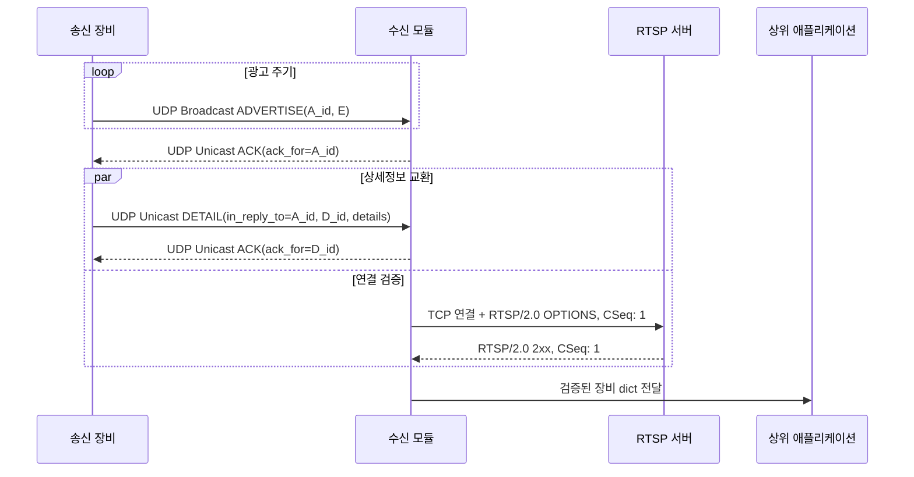
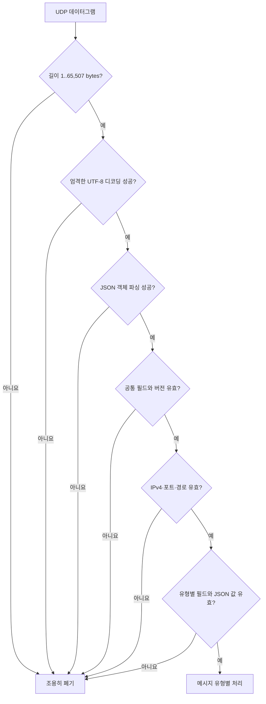

# RTSP 연결정보 부트스트랩 알고리즘

## 1. 문제 정의

이 모듈이 해결하는 문제는 동일한 IPv4 LAN에 있는 송신 장비를 자동으로 찾고, 장비가 광고한 RTSP 종단점이 실제로 RTSP 2.0 요청에 응답하는지 확인한 뒤, 검증된 연결 정보를 상위 애플리케이션에 전달하는 것이다.

이 프로토콜은 영상을 탐색하거나 재생하는 RTSP 규격이 아니다. UDP는 장비와 연결정보를 발견하기 위한 제어 채널로만 사용하고, 실제 연결 가능성은 별도의 RTSP `OPTIONS` 요청으로 확인한다.

알고리즘은 다음 목표를 동시에 만족해야 한다.

- 수신기의 주소를 사전에 몰라도 최초 장비 발견이 가능해야 한다.
- 최초 발견 이후의 메시지는 UDP 유니캐스트로 교환해야 한다.
- 동일 장비의 반복 광고와 동일 메시지의 재전송을 안전하게 처리해야 한다.
- 늦게 도착한 과거 `DETAIL`이 최신 연결정보를 되돌리지 못해야 한다.
- RTSP 응답 지연이 UDP 수신과 ACK 전송을 막지 않아야 한다.
- 종료와 재시작 뒤에 이전 실행의 비동기 결과가 현재 상태를 변경하지 못해야 한다.

## 2. 메시지와 상관관계

모든 메시지는 UTF-8 JSON 객체이며 공통적으로 다음 값을 가진다.

| 필드 | 알고리즘에서의 의미 |
|---|---|
| `protocol_version` | 해석 가능한 wire 형식인지 판정한다. 현재 허용값은 `1.0`이다. |
| `message_type` | `ADVERTISE`, `DETAIL`, `ACK` 중 처리 분기를 선택한다. |
| `device_id` | 장비 상태 테이블의 기본 키이다. |
| `message_id` | 한 메시지 인스턴스를 식별하고 중복을 제거한다. |
| `ip`, `rtsp_port`, `rtsp_path` | RTSP 종단점 `E = (ip, port, path)`을 구성한다. |

`DETAIL`은 추가로 `details`와 `in_reply_to`를 가진다. `in_reply_to`는 해당 상세정보를 유발한 `ADVERTISE.message_id`를 가리킨다. `ACK`의 `ack_for`는 수신 완료를 확인하는 원본 메시지의 `message_id`를 가리킨다.

상관 ID가 필요한 이유는 UDP가 손실, 중복, 지연, 재정렬될 수 있기 때문이다. 단순히 같은 `device_id`라는 이유만으로 늦은 `DETAIL`이나 `ACK`를 받아들이면 이전 종단점이 최신 상태를 덮거나 다른 수신자의 ACK를 잘못 처리할 수 있다.

## 3. 전체 프로토콜 흐름



수신기는 유효한 `ADVERTISE`를 등록한 직후 그 UDP 발신 주소로 ACK를 보낸다. 송신기는 이 ACK의 발신 주소를 통해 수신기의 유니캐스트 종단점을 학습하고 같은 주소로 `DETAIL`을 보낸다. 따라서 별도의 등록 메시지 유형 없이도 “최초 브로드캐스트, 이후 유니캐스트”가 성립한다.

`ADVERTISE` ACK, `DETAIL` 교환, RTSP 검증은 서로 불필요하게 기다리지 않는다. 특히 ACK는 JSON 정보의 수신 완료만 뜻하며 RTSP 연결이나 영상 재생 성공을 뜻하지 않는다.

## 4. 입력 검증 알고리즘

네트워크에서 받은 데이터는 상태 테이블에 접근하기 전에 완전히 검증한다.



검증 규칙은 다음과 같다.

1. 데이터그램 크기는 UDP payload의 상한인 65,507바이트를 넘지 않는다.
2. 바이트열은 엄격한 UTF-8이어야 하고 JSON 최상위 값은 객체여야 한다.
3. 필수 문자열은 비어 있지 않고 UTF-8로 다시 인코딩 가능해야 한다. 이 검사로 lone surrogate와 같은 비정상 문자열을 차단한다.
4. IP는 IPv4여야 하며 RTSP 포트는 `1..65535` 범위의 정수여야 한다. `bool`은 정수로 취급하지 않는다.
5. RTSP 경로는 `/`로 시작하고 공백이나 제어 문자를 포함하지 않는다.
6. `DETAIL.details`를 포함한 전체 값은 순환 참조, `NaN`, 양·음의 무한대가 없는 JSON 값이어야 한다.
7. `DETAIL.in_reply_to`와 `ACK.ack_for`는 비어 있지 않은 유효한 상관 ID여야 한다.

잘못된 네트워크 입력은 예상 가능한 외부 사건이므로 예외를 수신 루프 밖으로 전파하지 않고 폐기한다. 반면 잘못된 생성자 인자처럼 호출자가 만든 구성 오류는 즉시 실패시켜 실행 중간의 불확실성을 줄인다.

## 5. 송신 알고리즘

### 5.1 주기 광고

송신기는 하나의 UDP 소켓을 브로드캐스트 송신과 ACK 수신에 함께 쓴다. 같은 소켓을 사용해야 수신기가 ACK를 보낼 정확한 유니캐스트 주소와 포트를 유지할 수 있다.

```text
procedure SENDER_LOOP
    socket := UDP_SOCKET(broadcast_enabled = true)
    bind(socket, configured_local_endpoint)
    next_advertise := now

    while not stopped:
        if now >= next_advertise:
            A := new ADVERTISE(unique_message_id(), advertised_endpoint)
            remember A before transmission
            send A to broadcast_endpoint
            next_advertise := now + advertise_interval

        wait briefly for one datagram, bounded by next_advertise
        if a valid ACK arrives:
            PROCESS_ACK(ACK, peer)
```

광고 이력은 반드시 `sendto`보다 먼저 등록한다. 송신 후 등록하면 같은 LAN에서 매우 빠르게 돌아온 ACK가 이력에 없는 메시지로 판정되는 경쟁 조건이 생길 수 있다. 송신 자체가 실패하면 미리 등록한 이력을 되돌린다.

### 5.2 ACK 처리와 DETAIL 전송

```text
procedure PROCESS_ACK(ack, peer)
    require ack.device_id = local_device_id
    require ack.endpoint = advertised_endpoint

    if ack.ack_for is a known ADVERTISE:
        key := (ack.ack_for, peer.ip, peer.port)
        if key was already handled:
            return
        remember key

        D := new DETAIL(
            in_reply_to = ack.ack_for,
            endpoint = advertised_endpoint,
            details = configured_details
        )
        remember (D.message_id -> peer) before transmission
        unicast D to peer
        return

    if ack.ack_for is a pending DETAIL:
        require peer = pending peer for that DETAIL
        if this DETAIL ACK was not recorded:
            record it and wake its waiters
```

동일 광고에 대해 여러 수신기가 각각 ACK할 수 있으므로 광고 ACK 중복 키에는 peer 주소가 포함된다. 반면 `DETAIL` ACK는 DETAIL을 보낸 peer와 정확히 일치해야 한다.

`wait_for_ack`는 조건 변수로 특정 DETAIL의 ACK를 기다린다. 송신기가 중지되거나 새 실행 세대로 넘어가면 이전 세대의 무기한 대기자도 `None` 결과로 해제한다. 이를 위해 ACK 조건뿐 아니라 실행 세대 번호를 함께 조건식에 넣는다.

## 6. 수신 알고리즘

### 6.1 핵심 상태

수신기는 다음 논리 상태를 유지한다.

```text
devices[device_id] -> 최신 장비 dict
seen_messages[(device_id, message_id)] -> 중복 판정 이력
latest_advertisement[device_id] -> (message_id, endpoint, peer, epoch)
advertisement_context[(device_id, message_id)] -> (endpoint, peer, epoch)
inflight_probe[device_id] -> (run_generation, token, endpoint)
last_probe_success[device_id] -> monotonic timestamp
reported_endpoint[device_id] -> 마지막 성공 통지 endpoint
device_seen_sequence[device_id] -> 마지막 유효 메시지의 순번
```

장비의 논리적 동일성은 `device_id`로 판단한다. 따라서 상태 테이블에는 장비마다 하나의 최신 레코드만 남는다. 종단점은 `(ip, rtsp_port, rtsp_path)` 튜플로 비교하며, 같은 장비가 새 종단점을 광고하면 이전 종단점의 상세정보와 연결 성공 상태를 이어받지 않는다.

### 6.2 메시지 분기

```text
procedure RECEIVE_DATAGRAM(payload, peer)
    message := VALIDATE_AND_DECODE(payload)
    if invalid:
        return

    if message.type = ADVERTISE:
        is_new := REMEMBER_MESSAGE(message)
        needs_probe := REGISTER_ADVERTISEMENT(message, peer, is_new)
        send ACK(message.message_id) to peer
        if needs_probe:
            SCHEDULE_PROBE(message)
        return

    if message.type = DETAIL:
        if not MATCHES_CURRENT_CONTEXT(message, peer):
            return
        is_new := REMEMBER_MESSAGE(message)
        accepted, callback_data := REGISTER_DETAIL(message, is_new)
        if accepted:
            send ACK(message.message_id) to peer
        if callback_data exists:
            invoke callback(callback_data)
```

중복 `ADVERTISE`는 다시 RTSP 작업을 만들지 않지만 ACK는 다시 보낸다. 중복 `DETAIL`도 상세 상태와 콜백을 다시 적용하지 않지만 ACK는 다시 보낸다. 이 규칙은 이전 ACK가 손실된 경우 송신기가 재전송으로 회복할 수 있게 한다.

### 6.3 최신 장비 등록과 재검증

새 광고를 받으면 `devices[device_id]`를 갱신하고 RTSP URI를 계산한다. 동일 종단점이면 기존 `details`와 아직 유효한 성공 상태를 보존할 수 있다. 종단점이 바뀌면 다음 값을 초기화한다.

- `details = {}`
- 이전 성공 통지 이력
- 이전 RTSP 성공 시각
- 새 종단점에 적용할 연결 결과

성공한 RTSP 검증은 일정 TTL 동안 신선한 것으로 간주한다. 같은 종단점의 새 광고가 TTL 안에 도착하면 불필요한 재검증을 생략하고, TTL이 지났으면 다시 검증한다. 실패 상태에서는 다음의 새 광고가 재시도 기회가 된다.

### 6.4 DETAIL 재정렬과 상태 롤백 방지

`DETAIL`을 단순히 “가장 최근 광고 ID와 같은가”만으로 검사하면 다음 정상적인 재정렬을 놓친다.

```text
ADVERTISE A(endpoint E) 수신
ADVERTISE B(endpoint E) 수신
DETAIL(in_reply_to=A, endpoint E) 수신
```

반대로 과거 종단점의 DETAIL을 허용하면 다음 상태 롤백이 발생한다.

```text
ADVERTISE A(endpoint OLD) 수신
ADVERTISE B(endpoint NEW) 수신
DETAIL(in_reply_to=A, endpoint OLD) 지연 수신  -> 반드시 거부
```

두 경우를 구분하기 위해 장비별 문맥 세대 `epoch`를 둔다. 종단점 또는 UDP peer가 바뀔 때만 epoch를 증가시킨다. 각 광고는 수신 당시의 `(endpoint, peer, epoch)` 문맥을 저장한다.

```text
function MATCHES_CURRENT_CONTEXT(detail, peer):
    E := endpoint(detail)
    C := advertisement_context[(detail.device_id, detail.in_reply_to)]
    L := latest_advertisement[detail.device_id]
    D := devices[detail.device_id]

    return C exists
       and L exists
       and C = (E, peer, L.epoch)
       and (L.endpoint, L.peer) = (E, peer)
       and endpoint(D) = E
```

따라서 같은 peer와 같은 종단점에서 연속으로 온 광고 사이의 재정렬은 허용하지만, 한 번이라도 종단점 또는 peer가 전환된 과거 문맥은 거부한다. 거부된 DETAIL에는 ACK도 보내지 않으므로 송신기가 잘못된 정보를 확정했다고 오인하지 않는다.

## 7. 비동기 RTSP 연결 검증

RTSP 검증은 UDP 수신 루프와 분리된 제한된 worker 집합에서 수행한다. 수신 루프가 직접 TCP timeout을 기다리면 그동안 광고와 DETAIL을 받거나 ACK할 수 없기 때문이다.

### 7.1 작업 예약

```text
procedure SCHEDULE_PROBE(advertisement)
    E := endpoint(advertisement)
    token := advertisement.message_id
    generation := current_run_generation

    if same device and E already has an inflight probe:
        return
    if bounded probe queue is full:
        return

    inflight_probe[device_id] := (generation, token, E)
    worker executes PROBE(E)
    worker enqueues (generation, device_id, token, E, result)
```

worker는 공유 장비 상태를 직접 변경하지 않고 결과 큐에 값만 넣는다. 수신 루프가 큐를 비우면서 결과를 반영하므로 UDP 처리와 콜백의 상태 변경 순서를 한 곳에서 직렬화할 수 있다.

### 7.2 RTSP/2.0 성공 판정

```text
function PROBE(ip, port, path, timeout):
    deadline := monotonic_now() + timeout
    uri := build_percent_encoded_rtsp_uri(ip, port, path)

    connect TCP using remaining(deadline)
    send "OPTIONS <uri> RTSP/2.0" with "CSeq: 1"
    read until CRLF CRLF, deadline, or 16,384-byte header limit

    require a complete header
    require status line protocol = RTSP/2.0
    require status code in 200..299
    require response CSeq = 1
    return true if all conditions hold, otherwise false
```

TCP 연결, 요청 송신, 응답 수신에 각각 독립 timeout을 주지 않고 하나의 단조시계 deadline을 공유한다. 그래야 단계 수만큼 전체 제한시간이 늘어나지 않는다.

### 7.3 오래된 결과 제거

비동기 작업이 끝날 때는 작업을 시작한 뒤 상태가 바뀌었을 수 있다. 결과는 다음 세 조건을 모두 만족할 때만 반영한다.

```text
result.generation = current_run_generation
inflight_probe[device_id] = (generation, token, endpoint)
devices[device_id].endpoint = result.endpoint
```

이 검사는 다음 경쟁 조건을 제거한다.

- 종료 전 시작한 작업이 재시작 후 결과를 쓰는 경우
- 오래 걸린 이전 광고의 작업이 더 최신 광고 결과를 덮는 경우
- 장비 종단점이 변경됐는데 이전 종단점의 성공이 늦게 도착하는 경우

## 8. 상위 애플리케이션 전달 알고리즘

상위 모듈에 전달하는 레코드는 최소한 다음 정보를 가진다.

```json
{
  "device_id": "camera-01",
  "ip": "192.168.0.10",
  "rtsp_port": 8554,
  "rtsp_path": "/stream",
  "rtsp_uri": "rtsp://192.168.0.10:8554/stream",
  "details": {},
  "rtsp_connected": true
}
```

콜백은 RTSP 검증에 성공했을 때만 처음 발생한다. 이후 연결된 같은 장비에 새로운 `DETAIL`이 반영되어 `details`가 실제로 달라질 때마다 최신 dict로 다시 발생할 수 있다. DETAIL이 먼저 도착하고 RTSP가 나중에 성공하면 최초 성공 콜백에 이미 상세정보가 포함된다.

같은 성공 종단점의 반복 광고는 콜백을 반복시키지 않는다. 실패가 관찰되면 성공 통지 이력을 지우므로 이후 복구 성공은 다시 통지한다. 콜백에는 내부 상태의 깊은 복사본을 넘겨 호출자가 내부 장비 테이블을 변경하지 못하게 한다. 콜백 예외는 수신 알고리즘을 종료시키지 않는다.

시간 제한 발견 호출은 벽시계 비교 대신 단조 증가하는 메시지 순번을 사용한다.

```text
procedure DISCOVER(timeout):
    start_sequence := current_message_sequence
    receive for timeout
    return deep copies of devices where
        device.rtsp_connected = true and
        device_seen_sequence[device.id] > start_sequence
```

따라서 같은 수신기 인스턴스를 재사용해도 이전 호출에서만 발견된 장비가 다음 호출 결과에 섞이지 않는다. 반복 메시지라도 현재 호출 구간에 유효하게 수신됐다면 해당 장비의 관찰 순번을 갱신한다.

## 9. 종료, 재시작, 자원 상한

종료 플래그는 UDP 루프, ACK 대기, RTSP 결과 반영의 공통 취소 신호이다. 실행을 시작할 때마다 `run_generation`을 증가시키며, 이전 세대의 임시 상태와 대기자를 취소한다.

RTSP worker가 수신기 종료를 요청할 수도 있으므로 자기 자신을 기다리는 shutdown을 피해야 한다. worker는 결과만 큐에 넣고, 종료가 worker 문맥에서 시작된 경우 executor의 완료 대기를 생략한다. 늦게 끝난 작업은 실행 세대 검사에서 폐기된다.

무한한 네트워크 입력으로 메모리가 계속 증가하지 않도록 다음 구조는 설정된 상한을 넘으면 가장 오래된 항목부터 제거한다.

- 수신 메시지 중복 이력
- 광고 상관 문맥 이력
- 송신 광고 이력
- 처리한 광고 ACK 이력
- 보류 DETAIL 및 DETAIL ACK 이력
- RTSP worker 수와 대기 작업 수

장비 테이블 자체는 `device_id`별 최신 상태를 보존하는 핵심 결과이므로 자동 축출하지 않는다. 장기 실행 환경에서 사라진 장비까지 제거해야 한다면 별도의 장비 만료 정책을 상위 계층 또는 향후 확장으로 추가해야 한다.

## 10. 불변식

알고리즘의 정확성은 다음 불변식으로 요약할 수 있다.

1. `devices`에는 각 `device_id`마다 최대 하나의 최신 레코드만 존재한다.
2. 상위 모듈에는 `rtsp_connected = true`인 레코드만 발견 성공으로 전달한다.
3. ACK는 정보 수신 확인이며 RTSP 성공 상태를 변경하지 않는다.
4. DETAIL은 알려진 광고 문맥, 현재 endpoint, 현재 peer, 현재 epoch와 모두 일치할 때만 상태를 변경한다.
5. 동일 메시지는 상태 변경과 콜백을 한 번만 유발하지만, 허용된 중복 메시지에는 ACK를 재전송한다.
6. 비동기 RTSP 결과는 현재 실행 세대, 현재 작업 token, 현재 endpoint가 모두 일치할 때만 반영한다.
7. 네트워크에서 유래한 형식 오류, timeout, 연결 실패, 콜백 예외는 서비스 루프를 종료시키지 않는다.

## 11. 시간·공간 복잡도

다음 기호를 사용한다.

- `B`: 데이터그램 바이트 수
- `D`: 상세정보 JSON 크기
- `N`: 서로 다른 장비 수
- `K`: 중복 및 상관 이력 상한
- `P`: 동시 실행 및 대기 가능한 RTSP 검증 수

| 연산 | 평균 시간 복잡도 | 추가 공간 복잡도 |
|---|---:|---:|
| 메시지 디코딩·검증 | `O(B)` | `O(B)` |
| 장비 조회·중복 판정·상관 조회 | `O(1)` | 항목당 `O(1)` |
| DETAIL 저장 또는 콜백용 깊은 복사 | `O(D)` | `O(D)` |
| 장비 snapshot 생성 | `O(N + 전체 details 크기)` | 동일 |
| RTSP 헤더 판정 | `O(H)` | `O(H)`, `H <= 16,384` |

전체 장기 상태는 대략 `O(N + K + P + details 총량)`이다. 해시 테이블 연산은 평균 `O(1)`이며, 충돌이 극단적인 경우의 최악 시간은 언어 런타임의 사전 구현에 따른다.

## 12. 장애 상황별 수렴 방식

| 상황 | 처리 | 수렴 근거 |
|---|---|---|
| ADVERTISE 손실 | 다음 주기에 재방송 | 광고가 주기적이다. |
| ADVERTISE ACK 손실 | 다음 광고에 다시 ACK | 새 광고 ID로 교환을 다시 시작한다. |
| DETAIL 손실 | 다음 주기 ADVERTISE/ACK에서 새 DETAIL 교환 | 주기 광고가 교환을 다시 시작한다. |
| DETAIL ACK 손실 | 다음 광고 흐름으로 다시 교환하며, 같은 유효 DETAIL이 재전송되면 다시 ACK | 중복 상태 변경은 막되 허용된 DETAIL의 ACK는 반복한다. |
| 잘못된 JSON·UTF-8 | 데이터그램 폐기 | 수신 루프는 계속 실행된다. |
| RTSP timeout·비-2xx | 연결 실패 상태 유지 | 다음 새 광고에서 재검증할 수 있다. |
| 장비 endpoint 변경 | 상세정보·성공 이력 초기화 | 과거 endpoint 상태가 전이되지 않는다. |
| 과거 DETAIL 지연 도착 | 문맥 epoch 검사로 폐기 | 최신 상태 롤백을 막는다. |
| 종료 중 RTSP 결과 도착 | 실행 세대 검사로 폐기 | 새 실행 상태를 오염시키지 않는다. |
| 콜백 실패 | 예외 기록 후 계속 | 네트워크 루프와 실패 경계를 분리한다. |
