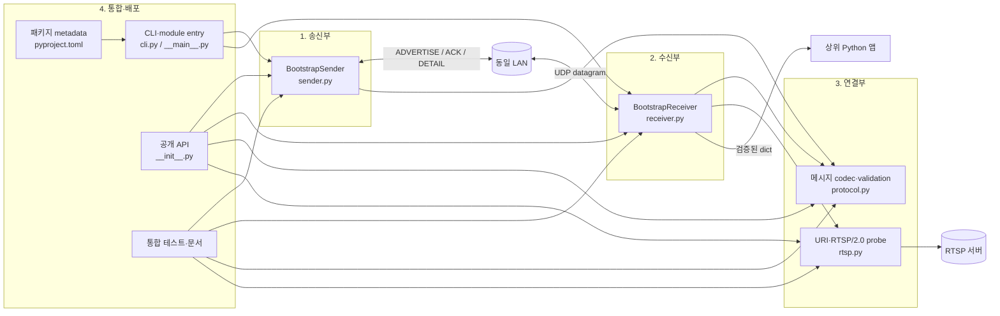

# RTSP 연결정보 부트스트랩 프로젝트 역할별 기술 문서

## 1. 문서 목적

이 문서는 프로젝트를 네 명이 나누어 개발한다는 전제에서 현재 코드를 다음 네 파트로 분해한다.

1. 송신부 개발
2. 수신부 개발
3. 연결부 개발
4. 통합 및 배포 관리 개발

각 역할의 설명은 단순 업무 목록이 아니라 담당 파일, 공개 API, 내부 자료구조, 동시성 책임, 오류 경계, 테스트와 다른 역할에 제공하는 계약까지 포함한다. 알고리즘 자체의 상세한 설명은 [`algo.md`](algo.md)를 기준으로 하고, 이 문서는 그 알고리즘이 코드상 어느 역할에 배치되는지를 설명한다.

## 2. 역할 분할 원칙

| 역할 | 1차 소유 코드 | 핵심 산출물 | 완료 판단 |
|---|---|---|---|
| 송신부 개발 | `src/rtsp_bootstrap/sender.py` | 주기적 ADVERTISE, ACK 수신, DETAIL 유니캐스트, DETAIL ACK 조회 | 여러 수신자와 손실·중복 상황에서도 송신 루프와 대기 API가 일관되게 동작한다. |
| 수신부 개발 | `src/rtsp_bootstrap/receiver.py` | 장비 등록, 중복 제거, DETAIL 반영, RTSP 작업 조정, callback/discover 결과 | 장비별 최신 상태와 검증 성공 결과를 안전하게 제공한다. |
| 연결부 개발 | `src/rtsp_bootstrap/protocol.py`, `src/rtsp_bootstrap/rtsp.py` | JSON wire 계약, 메시지 검증·직렬화, RTSP URI와 RTSP/2.0 probe | 양쪽 통신 코드가 같은 형식을 사용하며 실제 RTSP 2.0 성공을 엄격히 판정한다. |
| 통합 및 배포 관리 개발 | `cli.py`, `__main__.py`, `__init__.py`, `pyproject.toml`, 문서와 통합 테스트 | CLI, 공개 import 면, 패키징, 사용자 문서, 전체 절차 검증 | 설치 가능한 배포물이 CLI와 Python API 양쪽에서 같은 동작을 제공한다. |

“1차 소유”는 독점 수정 권한을 뜻하지 않는다. wire 형식, 콜백 dict, lifecycle처럼 둘 이상의 파트에 영향을 주는 변경은 관련 역할이 함께 검토해야 한다.

## 3. 코드 의존 관계



의존 방향에서 중요한 점은 송신부와 수신부가 wire 규칙을 각각 재구현하지 않고 연결부의 codec을 공통 사용한다는 것이다. 수신부도 RTSP 응답을 직접 파싱하지 않고 연결부의 probe 함수 또는 동일 시그니처의 주입 함수를 호출한다.

## 4. 파트 사이의 공통 코드 계약

### 4.1 wire 메시지 계약

송신부와 수신부는 Python 내부 객체를 직접 공유하지 않는다. 연결부가 보장하는 UTF-8 JSON만 교환하며 다음 상관 필드를 지켜야 한다.

| 송신 메시지 | 응답 또는 후속 메시지 | 상관 규칙 |
|---|---|---|
| `ADVERTISE.message_id = A` | `ACK.ack_for = A` | 송신부는 자신이 보낸 광고 이력과 ACK peer를 확인한다. |
| `ADVERTISE.message_id = A` | `DETAIL.in_reply_to = A` | 수신부는 광고 당시 endpoint, peer, 문맥 세대를 확인한다. |
| `DETAIL.message_id = D` | `ACK.ack_for = D` | 송신부는 DETAIL을 보낸 peer와 ACK peer가 같은지 확인한다. |

세 파트 모두 endpoint를 `(ip, rtsp_port, rtsp_path)`의 동일한 의미로 사용해야 한다. 필드 추가 또는 의미 변경은 `protocol_version` 정책과 함께 결정해야 하며 한쪽만 먼저 배포해서는 안 된다.

### 4.2 상위 애플리케이션 dict 계약

수신부가 callback과 `discover()`로 전달하는 값은 내부 상태의 깊은 복사본이며 다음 키를 포함한다.

| 키 | 형식 | 생산 책임 |
|---|---|---|
| `protocol_version` | `str` | 연결부가 검증하고 수신부가 보존 |
| `device_id` | `str` | 송신부가 설정, 연결부가 검증, 수신부가 장비 키로 사용 |
| `message_id` | `str` | 마지막으로 상태에 반영된 메시지 ID |
| `ip` | IPv4 문자열 | 송신부가 설정, 연결부가 검증 |
| `rtsp_port` | `1..65535` 정수 | 송신부가 설정, 연결부가 검증 |
| `rtsp_path` | `/`로 시작하는 문자열 | 송신부가 설정, 연결부가 검증 |
| `rtsp_uri` | `rtsp://...` 문자열 | 연결부의 `build_rtsp_uri()`로 생성 |
| `details` | JSON 객체 | 송신부가 제공하고 수신부가 현재 문맥에 병합 |
| `rtsp_connected` | `bool` | 연결부의 probe 결과를 수신부가 상태에 반영 |
| `last_seen` | Unix timestamp | 수신부가 유효 메시지 수신 시 갱신 |

상위 앱에는 RTSP probe 성공 장비만 성공 결과로 전달하지만, `get_devices()`는 실패 장비까지 포함한 현재 상태를 반환할 수 있다.

### 4.3 동시성 계약

- 송신부와 수신부의 `start()`는 백그라운드 네트워크 thread를 만들며, `serve_forever()`는 현재 thread에서 같은 서비스 루프를 실행한다.
- 연결부의 codec 함수는 호출 단위의 지역 상태만 사용하므로 양쪽 thread에서 공유할 수 있다.
- 수신부의 RTSP probe는 제한된 worker pool에서 실행된다. worker는 장비 테이블을 직접 변경하지 않고 결과 큐에 넣는다.
- 수신 callback은 내부 lock을 잡지 않은 상태에서 호출하며, callback 예외는 수신 서비스를 중단시키지 않는다.
- 외부로 반환하는 dict는 깊은 복사본이다. 호출자가 이를 수정해도 내부 상태는 바뀌지 않아야 한다.

## 5. 역할 1 — 송신부 개발

### 5.1 담당 범위

주 담당 파일은 `src/rtsp_bootstrap/sender.py`이며 공개 클래스는 `BootstrapSender`이다. 송신부는 장비의 정적 연결정보를 보유하고, 광고를 시작하며, ACK를 통해 수신자 주소를 학습하고, 상세정보를 유니캐스트로 전달한다.

송신부는 RTSP 서버를 열거나 영상을 송출하지 않는다. 광고하는 `ip`, `rtsp_port`, `rtsp_path`가 실제 서비스와 맞는지는 장비 애플리케이션의 책임이고, 그 종단점 검증은 수신·연결부의 책임이다.

### 5.2 공개 API 책임

| API | 코드 수준의 책임 |
|---|---|
| `BootstrapSender(...)` | 장비 ID, endpoint, 상세 JSON, UDP 주소, 광고 주기, history 상한을 검증하고 상태를 준비한다. |
| `start(startup_timeout=...)` | 백그라운드 thread를 시작하고 UDP bind 성공 또는 실패가 확정될 때까지 기다린다. |
| `serve_forever()` | 호출 thread에서 송신·수신 루프를 실행하며 초기 bind 오류를 호출자에게 전달한다. |
| `stop(wait=True, timeout=None)` / `close()` | 종료 신호를 설정하고 소켓과 ACK 대기자를 깨우며 선택적으로 thread 종료를 기다린다. `close`는 `stop`의 alias다. |
| `advertise_once()` | 실행 중인 소켓으로 고유 ID의 ADVERTISE를 즉시 한 번 보내고 그 ID를 반환한다. |
| `send_detail(peer, in_reply_to=...)` | 지정 peer로 상관된 DETAIL을 보내고 DETAIL ID를 반환한다. |
| `wait_for_ack(message_id, timeout=...)` | 해당 DETAIL ACK 기록을 기다리며 ACK dict 또는 `None`을 반환한다. |
| `get_detail_acks()` | 수집한 DETAIL ACK 이력의 복사본을 반환한다. |
| `local_address`, `is_running` | 실제 bind 주소와 lifecycle 상태를 읽기 전용으로 제공한다. |

`advertise_once()`와 `send_detail()`은 CLI 외의 프로그램이나 통합 테스트가 프로토콜 단계를 명시적으로 구동할 때 쓰인다. 정상 주기 실행에서는 ADVERTISE ACK를 받은 `_handle_ack()`가 `_send_detail()`을 자동 호출한다.

### 5.3 내부 구현 책임

송신 담당자는 다음 상태의 일관성을 유지해야 한다.

- `_advertisements`: 자신이 발행한 광고 ID와 endpoint 이력
- `_handled_advertisement_acks`: `(advertise_id, peer_ip, peer_port)` 단위의 중복 ACK 이력
- `_pending_details`: DETAIL ID에서 전송 peer로 가는 대기 테이블
- `_detail_acks`: 확인된 DETAIL ACK 이력
- `_run_generation`, `_cancelled_generation`: 종료·재시작 경계를 구분하는 세대 번호
- `_ack_condition`: `wait_for_ack()` 대기자와 네트워크 thread를 연결하는 조건 변수

UDP 송신 전 pending/history를 먼저 기록하고 송신 실패 시 롤백해야 한다. 이 순서를 바꾸면 ACK가 매우 빠른 환경에서 응답을 놓칠 수 있다. 모든 이력은 `history_capacity`로 제한하고 `OrderedDict`의 오래된 항목부터 제거한다.

`_handle_ack()`는 다음을 모두 검증한 후 상태를 바꾼다.

1. 메시지 유형이 ACK인지
2. `device_id`와 endpoint가 로컬 광고값과 같은지
3. `ack_for`가 실제 광고 또는 보류 DETAIL을 가리키는지
4. DETAIL ACK라면 UDP peer가 최초 DETAIL 전송 대상과 같은지

### 5.4 lifecycle과 thread 안전성

`_state_lock`은 프로토콜 이력, `_lifecycle_lock`은 thread·socket 교체, `_ack_condition`은 ACK 대기 통지에 사용한다. lock을 추가할 때는 기존 획득 순서를 지켜 교착을 만들지 않아야 한다.

`stop(wait=False)` 직후 `start()`가 호출될 수 있으므로 살아 있는 이전 thread와 새 실행을 구분해야 한다. 새 실행은 세대 번호를 증가시키고 이전 세대의 ACK 대기자를 취소한다. 이전 대기자가 새로 clear된 stop event만 보고 영구 대기하지 않도록 조건식에 세대 번호를 포함한다.

### 5.5 담당 테스트

1차 담당 테스트는 `tests/test_sender.py`이다.

- 비-JSON detail을 실행 전에 거부하는지
- `stop()`이 무기한 ACK 대기자를 해제하는지
- `stop(wait=False)` 뒤 즉시 재시작할 수 있는지
- 재시작 때 이전 실행 세대의 waiter가 취소되는지

연결부와 공동으로 `tests/test_protocol.py`, 수신부·통합 담당자와 공동으로 `tests/test_e2e.py`를 검토한다. 특히 ACK 필드가 바뀌면 단위 테스트만 고치지 말고 실제 UDP 왕복 테스트까지 갱신해야 한다.

### 5.6 다른 역할에 넘기는 계약

- 수신부에는 ADVERTISE의 UDP source endpoint로 ACK하면 DETAIL을 받을 수 있음을 보장한다.
- 연결부에는 `make_message()`에 넘기는 모든 송신 값이 생성 시 검증되도록 요구한다.
- 통합 담당자에는 생성자 오류와 bind 오류가 CLI exit code에 반영되도록 예외를 숨기지 않는다.

## 6. 역할 2 — 수신부 개발

### 6.1 담당 범위

주 담당 파일은 `src/rtsp_bootstrap/receiver.py`이며 공개 클래스는 `BootstrapReceiver`이다. 수신부는 UDP 데이터그램을 받아 장비별 최신 상태를 관리하고, DETAIL 문맥을 검증하고, RTSP probe 작업을 조정하며, 성공 결과를 callback 또는 반환값으로 제공한다.

### 6.2 공개 API 책임

| API | 코드 수준의 책임 |
|---|---|
| `BootstrapReceiver(...)` | bind 주소, RTSP timeout, probe 함수, worker/queue/history 상한과 callback을 검증·저장한다. |
| `start(startup_timeout=...)` | UDP listener와 RTSP executor를 시작하고 bind 결과를 동기적으로 알린다. |
| `serve_forever()` | 현재 thread에서 수신 루프를 실행하고 시작 오류를 호출자에게 전파한다. |
| `stop(wait=True, timeout=None)` / `close()` | listener와 worker를 안전하게 종료하며 callback 또는 probe 내부 호출도 교착시키지 않는다. `close`는 `stop`의 alias다. |
| `discover(timeout=...)` | 호출 시간 구간에 관찰되고 RTSP가 성공한 장비 snapshot 목록을 반환한다. |
| `get_devices()` | `device_id -> 최신 상태 dict`의 깊은 복사본을 반환한다. |
| `local_address`, `is_running` | 테스트와 임베딩 코드가 실제 listen 주소와 상태를 확인하게 한다. |

생성자의 `rtsp_probe` 주입점은 단위 테스트용에 그치지 않는다. 제한된 환경에서 다른 연결 확인 정책을 넣을 수 있는 명시적 연결부 경계이다. 함수 시그니처는 `(ip, port, path, timeout) -> bool`을 유지해야 한다.

### 6.3 장비 상태와 중복 처리

`_devices`는 `device_id`를 키로 사용하므로 여러 장비는 분리하고 같은 장비의 반복 광고는 한 레코드로 합친다. 반환 레코드에 `rtsp_uri`, `details`, `rtsp_connected`, `last_seen`을 함께 저장한다.

`_seen_messages`는 `(device_id, message_id)`를 키로 하는 bounded `OrderedDict`이다. 중복 메시지는 상태 변경과 callback을 반복하지 않지만 유효한 ADVERTISE와 DETAIL에는 ACK를 다시 보낸다. ACK 재전송은 UDP에서 첫 ACK가 유실됐을 때 상대가 수렴하기 위한 동작이므로 제거하면 안 된다.

새 endpoint가 오면 이전 endpoint의 details, probe 성공 시각, callback 보고 이력을 초기화한다. 같은 endpoint의 새 광고에는 성공 TTL이 남아 있는 동안 probe를 생략하고, 실패 상태 또는 TTL 만료 후에는 다시 검증한다.

### 6.4 DETAIL 상관관계 책임

수신 담당자는 `_latest_advertisements`, `_advertisement_contexts`, `_device_context_epoch` 세 자료구조를 함께 유지한다.

- 최신 광고는 현재 `(message_id, endpoint, peer, epoch)`를 가리킨다.
- 광고 문맥은 `(device_id, advertise_id)`에서 당시 `(endpoint, peer, epoch)`로 연결한다.
- endpoint 또는 peer가 전환될 때 장비 epoch를 증가시킨다.

`_detail_matches_latest_advertisement()`는 `in_reply_to`, endpoint, peer, epoch와 현재 장비 endpoint가 모두 일치할 때만 DETAIL을 허용한다. 이 검사는 같은 endpoint의 연속 광고 사이에서 재정렬된 DETAIL은 받아들이고, 이전 endpoint의 늦은 DETAIL은 거부하는 핵심 안전 경계이다.

### 6.5 RTSP 작업 조정 책임

수신부는 RTSP protocol 자체를 구현하지 않지만 probe 실행을 다음과 같이 조정한다.

- `ThreadPoolExecutor`의 worker 수를 `max_probe_workers`로 제한한다.
- `BoundedSemaphore`로 실행·대기 가능한 전체 probe 수를 `max_pending_probes`로 제한한다.
- 같은 장비·endpoint의 중복 inflight 작업을 만들지 않는다.
- worker는 `_probe_results` 큐에 결과만 넣고 listener thread가 `_complete_probe()`로 상태를 반영한다.
- `(run_generation, message token, endpoint)`가 현재 상태와 같은 결과만 반영한다.

성공 결과는 endpoint당 한 번 callback하고, 실패가 발생하면 보고 이력을 지워 이후 복구 성공을 다시 callback한다. 연결된 상태에서 details가 달라지면 최신 정보 전달을 위해 callback이 한 번 더 발생할 수 있다.

### 6.6 callback, discover, 종료 책임

callback은 lock 밖에서 깊은 복사본으로 호출하고 예외를 잡아 listener를 보호한다. callback에서 `stop()`을 호출할 수 있어야 하므로 listener나 worker가 자기 자신을 `join()`하는 경로가 없어야 한다.

주입된 probe 자체가 `stop()`을 부르는 경우도 고려한다. probe worker 문맥에서는 executor shutdown의 완료 대기를 피하고, 늦은 결과는 실행 세대로 폐기한다.

`discover()`는 호출 시작 시 `_message_sequence`를 snapshot하고, 종료 시 해당 순번 이후 관찰된 연결 성공 장비만 반환한다. 누적 `_devices` 전체를 그대로 반환하면 과거 호출에서만 보였던 장비가 새 발견 결과에 섞이므로 이 구간 필터를 유지해야 한다.

### 6.7 담당 테스트

1차 담당 테스트는 `tests/test_receiver.py`이다.

- 동일 장비·동일 메시지 중복 제거와 ACK 재전송
- DETAIL 갱신과 중복 DETAIL 처리
- 잘못된 패킷 및 probe 예외 뒤 listener 생존
- 과거 DETAIL의 endpoint 롤백 차단
- callback 내부 `stop()`과 probe 내부 `stop()`의 무교착
- 느린 RTSP probe와 독립적인 즉시 ADVERTISE ACK
- probe 실패 후 복구 callback
- 같은 endpoint의 재정렬 DETAIL 허용
- 제한시간 발견의 정상 종료

연결부와는 probe 시그니처 및 URI 의미를 공동 검토하고, 송신부와는 `tests/test_e2e.py`의 UDP 상관관계를 공동 소유한다.

### 6.8 다른 역할에 넘기는 계약

- 송신부에는 유효 메시지를 수신한 UDP peer로 ACK를 반환한다.
- 연결부에는 검증을 통과한 endpoint만 URI 생성과 probe에 넘긴다.
- 상위 앱과 통합 담당자에는 callback·snapshot이 내부 상태와 분리된 dict이고 RTSP 성공 장비만 발견 결과로 나감을 보장한다.

## 7. 역할 3 — 연결부 개발

연결부는 “UDP 메시지를 안전한 내부 값으로 변환하는 경계”와 “광고된 RTSP endpoint를 실제 RTSP 2.0으로 확인하는 경계”를 담당한다. 주 담당 파일은 `src/rtsp_bootstrap/protocol.py`와 `src/rtsp_bootstrap/rtsp.py`이다.

### 7.1 JSON 프로토콜 계층

`protocol.py`의 공개 요소는 다음과 같다.

| 요소 | 책임 |
|---|---|
| `PROTOCOL_VERSION` | 현재 wire 버전 `1.0`을 단일 상수로 제공한다. |
| `MessageType` | 허용 메시지 유형을 문자열 enum으로 제한한다. |
| `MessageError` | wire 생성·검증·직렬화·역직렬화 오류를 하나의 공개 예외로 통일한다. |
| `validate_message()` | 공통 필드, 유형별 필드, IPv4, 포트, 경로, JSON 가능 값을 검증하고 정규 dict를 반환한다. |
| `make_message()` | UUID4 기반 기본 ID와 유형별 필드를 조합한 뒤 같은 검증 경로를 거친다. |
| `encode_message()` | 정렬된 compact UTF-8 JSON bytes를 만들고 UDP payload 상한을 검사한다. |
| `decode_message()` | 크기, 엄격 UTF-8, JSON 객체와 schema를 순서대로 검증한다. |

연결 담당자는 송신과 수신에 서로 다른 검증 규칙이 생기지 않도록 생성 메시지도 `validate_message()`를 통과시켜야 한다. `json.dumps()`의 기본 동작이 허용하는 `NaN`이나 lone surrogate는 실제 상호운용 가능한 JSON·UTF-8이 아니므로 명시적으로 거부한다.

프로토콜 검증은 보안 경계이기도 하다. `rtsp_path`의 길이와 문자, 식별자 길이, 데이터그램 최대 크기, JSON 순환 참조를 제한하지 않으면 한 패킷이 listener를 종료시키거나 과도한 자원을 사용하게 할 수 있다.

### 7.2 RTSP 연결 계층

`rtsp.py`는 두 함수를 제공한다.

- `build_rtsp_uri(ip, port, path)`: 경로를 UTF-8 percent-encoding하고 `rtsp://<ip>:<port><path>`를 만든다.
- `probe_rtsp(ip, port, path, timeout=2.0)`: TCP 연결 후 RTSP/2.0 `OPTIONS`를 보내고 유효 응답 여부를 `bool`로 반환한다.

probe 성공 조건은 TCP connect 성공만이 아니다. 완전한 header terminator, 정확한 `RTSP/2.0` status line, `2xx` 상태 코드, 요청과 같은 `CSeq: 1`을 모두 확인한다. 전체 connect/send/receive 단계는 하나의 monotonic deadline을 공유하며 header는 16,384바이트로 제한한다.

네트워크 timeout, 연결 거부, 잘못된 응답은 정상적인 `False` 결과이고 호출자를 예외로 중단시키지 않는다. 반면 유한하지 않거나 0 이하인 timeout처럼 프로그래머가 잘못 지정한 값은 `ValueError`로 즉시 알린다.

### 7.3 담당 테스트

`tests/test_protocol.py`에서 다음을 1차 소유한다.

- 한글을 포함한 UTF-8 JSON round trip
- ACK/DETAIL 상관 ID 필수 조건
- 잘못된 버전·유형·IPv4·포트·경로 거부
- JSON이 아닌 detail 값과 비유한 수 거부
- lone Unicode surrogate 거부

`tests/test_rtsp.py`에서는 다음을 1차 소유한다.

- 실제 OPTIONS 요청 내용과 RTSP 2.0 성공
- 비-2xx, RTSP 1.0, 잘못된 CSeq 거부
- socket timeout의 `False` 변환
- 비 ASCII 경로의 URI percent-encoding

`tests/support.py`의 `FakeRtspServer` 응답 형식 변경은 통합 담당자와 함께 검토한다. fake가 실제 probe보다 느슨하면 통합 테스트가 잘못된 성공을 허용할 수 있다.

### 7.4 다른 역할에 넘기는 계약

- 송신부와 수신부에는 모든 유효 메시지가 공통 키와 유형별 상관 키를 가진 정규 dict임을 보장한다.
- 수신부에는 `probe_rtsp()`가 네트워크 실패를 `False`로 흡수하고 구성 오류만 예외로 구분함을 보장한다.
- 통합 담당자에는 protocol과 RTSP public symbol의 import 안정성을 제공한다.

## 8. 역할 4 — 통합 및 배포 관리 개발

### 8.1 담당 범위

통합 및 배포 담당자는 네트워크 핵심 알고리즘을 복제하지 않고 세 파트를 사용 가능한 패키지로 묶는다.

| 파일 | 담당 내용 |
|---|---|
| `src/rtsp_bootstrap/cli.py` | sender/receiver argument parser, 실행 수명, logging, JSON Lines 출력 |
| `src/rtsp_bootstrap/__main__.py` | `python -m rtsp_bootstrap` 진입점 |
| `src/rtsp_bootstrap/__init__.py` | 안정적인 public import와 `__all__`, package version |
| `src/rtsp_bootstrap/py.typed` | 타입 정보가 포함된 패키지임을 표시 |
| `pyproject.toml` | build backend, Python 버전, metadata, console script, package discovery |
| `README.md`, `algo.md`, `role.md` | 사용자 안내, 알고리즘, 역할·유지보수 문서 |
| `tests/test_cli.py`, `tests/test_e2e.py`, `tests/support.py` | CLI 및 실제 socket 기반 전체 절차 검증 |
| `LICENSE`, `.gitignore` | 배포 라이선스와 생성물 제외 정책 |

### 8.2 CLI 통합 책임

`cli.py`는 두 console script와 module subcommand가 같은 argument 구성 함수를 재사용하도록 한다.

```text
rtsp-bootstrap-sender  -> rtsp_bootstrap.cli:sender_main
rtsp-bootstrap-receiver -> rtsp_bootstrap.cli:receiver_main
python -m rtsp_bootstrap sender|receiver -> rtsp_bootstrap.cli:main
```

입력 경계에서 포트 범위, 유한한 시간값, JSON object인 `--detail-json`을 검사한다. Python의 기본 JSON parser가 허용하는 `NaN`과 `Infinity`도 CLI에서는 거부해야 한다. 잘못된 bind 주소나 생성자 값은 성공 종료로 숨기지 않고 argparse 오류와 non-zero exit로 보여야 한다.

receiver stdout은 상위 프로세스가 파싱할 수 있는 UTF-8 JSON Lines 전용이고 진단 logging은 stderr로 분리한다. Windows의 기본 코드 페이지에 의존하지 않도록 stdout encoding을 UTF-8로 명시한다. `Ctrl-C`와 제한시간 실행은 공통 `finally`에서 `stop()`을 호출해 socket/thread를 정리한다.

### 8.3 패키징 책임

`pyproject.toml`은 다음 배포 계약을 유지한다.

- 배포명: `rtsp-bootstrap`
- import package: `rtsp_bootstrap`
- 지원 Python: `>=3.12`
- build backend: `setuptools.build_meta`
- source layout: `src/`
- runtime dependency: 없음, Python 표준 라이브러리만 사용
- console entry point: sender와 receiver 각각 하나
- wheel에 `py.typed` 포함

`__init__.py`는 `BootstrapSender`, `BootstrapReceiver`, protocol codec, RTSP helper를 공개한다. 내부 lock, queue, private handler는 export하지 않는다. 버전을 변경할 때는 `pyproject.toml`과 `__version__`이 서로 달라지지 않도록 함께 갱신한다.

### 8.4 통합 테스트 책임

`tests/test_e2e.py`는 localhost의 실제 UDP socket과 `FakeRtspServer`를 사용해 다음 전체 흐름을 검증한다.

1. 두 송신 장비의 ADVERTISE 수신
2. 수신기의 ACK를 통한 유니캐스트 주소 학습
3. 송신기의 DETAIL 전송과 수신기의 DETAIL ACK
4. RTSP 2.0 성공 장비의 callback/discover 전달
5. `device_id`별 다중 장비 분리
6. DETAIL ACK와 RTSP 성공 의미의 분리
7. `discover()` 호출 구간 밖의 과거 장비 제외

`tests/test_cli.py`는 help 경로, 잘못된 bind의 non-zero 종료, 비유한 수와 잘못된 JSON 거부를 검증한다. 통합 담당자는 각 파트의 단위 테스트도 전체 suite에서 항상 함께 실행한다.

```powershell
python -m unittest discover -s tests -v
```

릴리스 검증에서는 반드시 Python 3.12 환경에서 다음을 확인한다.

1. 전체 단위·통합 테스트 통과
2. wheel과 sdist 빌드 성공
3. 새 가상환경에서 wheel 설치 성공
4. 두 console script와 `python -m rtsp_bootstrap` help 실행
5. wheel에 package 모듈, `py.typed`, 라이선스, entry point가 포함됐는지 확인
6. 가능한 경우 실제 동일 LAN 두 호스트에서 broadcast 발견과 RTSP probe 확인

### 8.5 문서 책임

통합 담당자는 README의 명령이 실제 셸에서 실행되고 public API와 일치하는지 검토한다. 특히 다음 의미가 문서마다 달라지지 않아야 한다.

- 이 패키지는 RTSP 연결정보 bootstrap이며 영상 디코더가 아니다.
- ADVERTISE를 받은 수신기는 RTSP 결과를 기다리지 않고 정보 수신 ACK를 보낸다.
- ACK는 영상 재생 성공을 의미하지 않는다.
- callback과 `discover()`에는 RTSP가 확인된 장비만 나온다.
- callback은 RTSP 성공 시점과 연결 후 상세정보가 실제로 바뀌는 각 시점에 관찰될 수 있다.
- 자동 발견 범위는 같은 IPv4 broadcast domain이다.

## 9. 역할 간 변경 승인 기준

코드의 소유 파일만 보고 독립적으로 병합하면 안 되는 변경은 다음과 같다.

| 변경 유형 | 필수 공동 검토 역할 | 이유 |
|---|---|---|
| JSON 필드, message type, protocol version 변경 | 송신 + 수신 + 연결 + 통합 | wire 양쪽, 문서, 호환성, E2E가 모두 바뀐다. |
| ACK 또는 DETAIL 상관 규칙 변경 | 송신 + 수신 + 연결 | 주소 학습, 중복 처리, 최신 상태 보호가 함께 영향을 받는다. |
| callback dict 또는 호출 시점 변경 | 수신 + 통합 | 공개 API, CLI JSON Lines, README 예제가 바뀐다. |
| RTSP 성공 판정 변경 | 수신 + 연결 + 통합 | 상태 전이, fake server, 완료 기준이 바뀐다. |
| start/stop/restart 동작 변경 | 해당 core 역할 + 통합 | CLI 종료, context manager, 교착 회귀 가능성이 있다. |
| CLI option 변경 | 해당 core 역할 + 통합 | 생성자 인자와 사용자 문서가 일치해야 한다. |
| Python 지원 버전·의존성 변경 | 네 역할 전체 | 문법, runtime, 배포 metadata와 테스트 환경에 영향을 준다. |

## 10. 역할별 인수인계 체크리스트

### 송신부

- 광고가 시작 직후 한 번, 이후 설정 주기로 전송되는가?
- ACK 상관 ID와 peer가 모두 검증되는가?
- DETAIL pending 상태를 UDP 송신 전에 등록하는가?
- 중복 ACK가 중복 DETAIL이나 중복 callback을 만들지 않는가?
- stop/restart가 이전 ACK waiter를 남기지 않는가?

### 수신부

- 장비 상태가 `device_id`별 하나로 유지되는가?
- 중복 상태 반영은 막으면서 ACK는 재전송하는가?
- DETAIL의 endpoint, peer, epoch 문맥을 모두 검사하는가?
- probe queue와 history가 설정 상한을 지키는가?
- callback/probe 안의 stop과 늦은 worker 결과가 안전한가?
- `discover()`가 현재 호출 구간의 성공 장비만 반환하는가?

### 연결부

- 생성과 수신이 같은 validation 경로를 사용하는가?
- UTF-8, IPv4, 포트, 경로, JSON 값, 데이터그램 크기 경계를 검사하는가?
- RTSP URI가 비 ASCII 경로를 올바르게 인코딩하는가?
- RTSP/2.0, 2xx, CSeq, 완전한 header를 모두 확인하는가?
- 네트워크 오류와 프로그래머 오류를 구분하는가?

### 통합 및 배포 관리

- CLI와 import API가 같은 core 구현을 호출하는가?
- stdout JSON과 stderr logging이 분리되는가?
- Python 3.12에서 source test와 설치 후 smoke test가 모두 통과하는가?
- wheel 내용, entry point, `Requires-Python`, 라이선스를 확인했는가?
- README, `algo.md`, `role.md`가 현재 코드 흐름과 일치하는가?

## 11. 통합 순서

네 역할이 병렬 개발한 결과를 합칠 때는 다음 순서가 안전하다.

1. 연결부가 wire schema와 RTSP probe 시그니처를 확정하고 protocol/RTSP 단위 테스트를 통과시킨다.
2. 송신부와 수신부가 그 계약에 맞춰 각각 lifecycle 및 상태 단위 테스트를 통과시킨다.
3. 송신부·수신부를 실제 UDP socket으로 연결한 E2E에서 ADVERTISE → ACK → DETAIL → ACK와 병렬 RTSP 검증을 확인한다.
4. 통합 담당자가 public import, CLI, UTF-8 JSON Lines, 오류 exit code를 검증한다.
5. Python 3.12에서 패키지를 빌드·설치한 뒤 console script smoke test와 전체 suite를 다시 실행한다.
6. 실제 동일 LAN 환경에서 broadcast 도달성, 방화벽, 광고 IP의 접근 가능성을 최종 확인한다.

이 순서를 따르면 wire 계약 실패, core 상태 실패, CLI·패키징 실패를 서로 다른 단계에서 분리해 진단할 수 있다.
